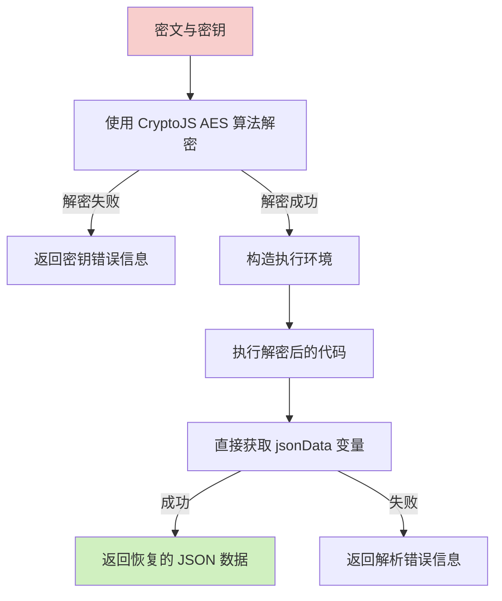

```mermaid
flowchart TD
    A[密文与密钥] --> B[使用 CryptoJS AES 算法解密]
    B -->|解密失败| C[返回密钥错误信息]
    B -->|解密成功| D[构造执行环境]
    D --> E[执行解密后的代码]
    E --> F[直接获取 jsonData 变量]
    F -->|成功| G[返回恢复的 JSON 数据]
    F -->|失败| H[返回解析错误信息]
    
    style A fill:#f8cecc
    style G fill:#d0f0c0
```