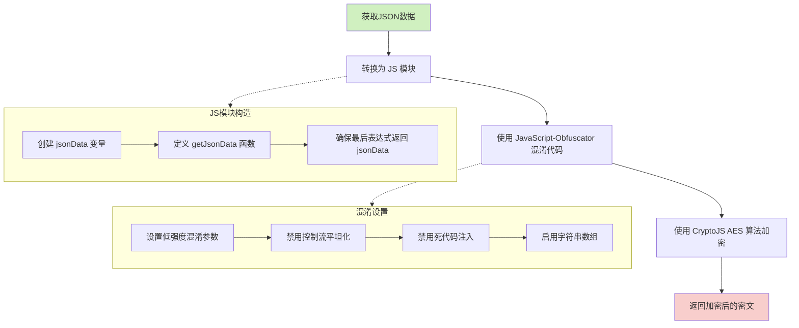

```mermaid

flowchart TD
    A[获取JSON数据] --> D[转换为 JS 模块]
    D --> E[使用 JavaScript-Obfuscator 混淆代码]
    E --> F[使用 CryptoJS AES 算法加密]
    F --> G[返回加密后的密文]
    
    subgraph JS模块构造
    D1[创建 jsonData 变量] --> D2[定义 getJsonData 函数]
    D2 --> D3[确保最后表达式返回 jsonData]
    end
    
    subgraph 混淆设置
    E1[设置低强度混淆参数] --> E2[禁用控制流平坦化]
    E2 --> E3[禁用死代码注入]
    E3 --> E4[启用字符串数组]
    end
    
    D -.-> JS模块构造
    E -.-> 混淆设置
    
    style A fill:#d0f0c0
    style G fill:#f8cecc

```