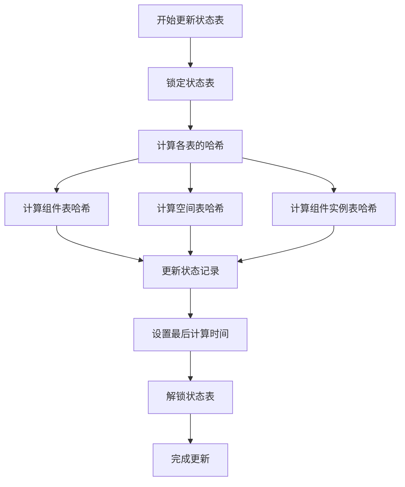

```mermaid
flowchart TD
    Start[开始更新状态表] --> LockStateTable[锁定状态表]
    LockStateTable --> CalculateHashes[计算各表的哈希]
    
    CalculateHashes --> ComponentsHash[计算组件表哈希]
    CalculateHashes --> SpacesHash[计算空间表哈希]
    CalculateHashes --> InstancesHash[计算组件实例表哈希]
    
    ComponentsHash --> UpdateStateRecord[更新状态记录]
    SpacesHash --> UpdateStateRecord
    InstancesHash --> UpdateStateRecord
    
    UpdateStateRecord --> SetLastCalculated[设置最后计算时间]
    SetLastCalculated --> UnlockStateTable[解锁状态表]
    UnlockStateTable --> End[完成更新]
```