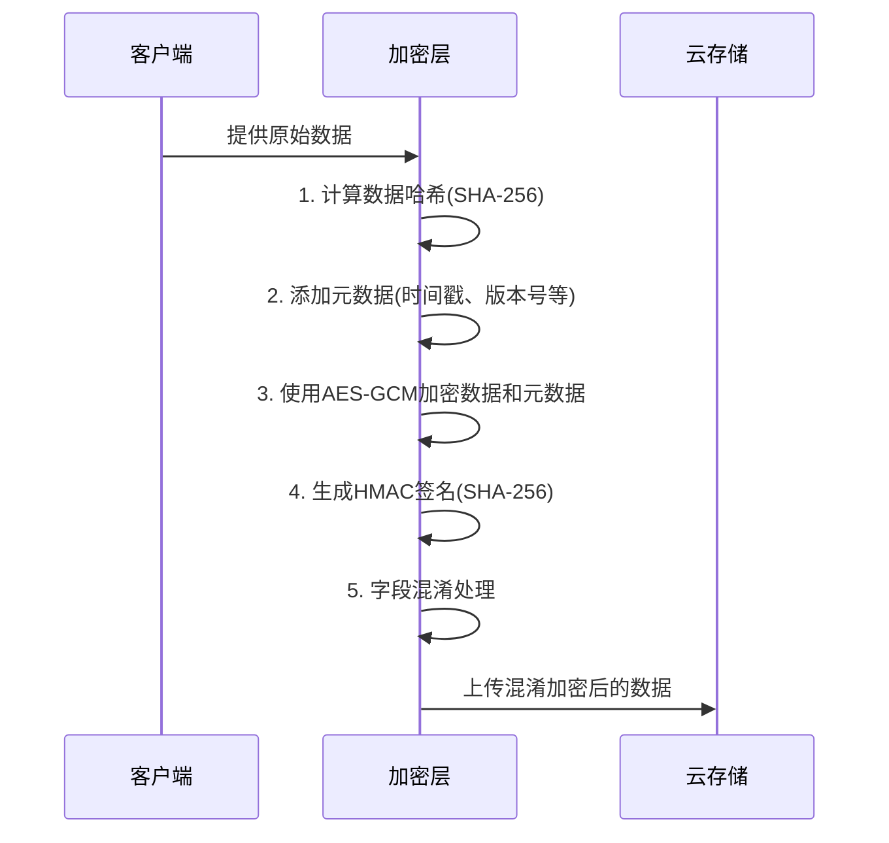

```mermaid
sequenceDiagram
    participant Client as 客户端
    participant EncryptionLayer as 加密层
    participant Cloud as 云存储
    
    Client->>EncryptionLayer: 提供原始数据
    EncryptionLayer->>EncryptionLayer: 1. 计算数据哈希(SHA-256)
    EncryptionLayer->>EncryptionLayer: 2. 添加元数据(时间戳、版本号等)
    EncryptionLayer->>EncryptionLayer: 3. 使用AES-GCM加密数据和元数据
    EncryptionLayer->>EncryptionLayer: 4. 生成HMAC签名(SHA-256)
    EncryptionLayer->>EncryptionLayer: 5. 字段混淆处理
    EncryptionLayer->>Cloud: 上传混淆加密后的数据
```