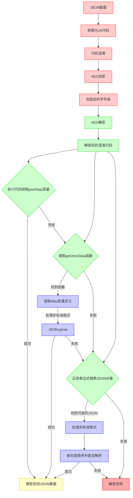

```mermaid
flowchart TD
    %% 加密混淆流程
    A[JSON数据] --> B[转换为JS代码]
    B --> C[代码混淆]
    C --> D[AES加密]
    D --> E[加密后的字符串]
    
    %% 解密还原流程
    E --> F[AES解密]
    F --> G[解密后的混淆代码]
    
    %% 解密后的多种解析尝试
    G --> H{执行代码获取jsonData变量}
    G --> I{提取getJsonData函数}
    G --> J{正则表达式搜索JSON对象}
    
    %% 执行代码路径
    H -->|成功| K[解密后的JSON数据]
    H -->|失败| I
    
    %% 提取函数路径
    I -->|找到函数| L[提取data变量定义]
    L -->|处理非标准格式| M[JSON.parse]
    M -->|成功| K
    I -->|失败| J
    M -->|失败| J
    
    %% 正则搜索路径
    J -->|找到可能的JSON| N[处理非标准格式]
    N --> O[按长度排序并尝试解析]
    O -->|成功| K
    O -->|失败| P[解密失败]
    J -->|失败| P
    
    %% 样式
    classDef encryption fill:#ffcccc,stroke:#ff0000
    classDef decryption fill:#ccffcc,stroke:#00cc00
    classDef process fill:#ccccff,stroke:#0000ff
    classDef output fill:#ffffcc,stroke:#cccc00
    classDef error fill:#ffaaaa,stroke:#cc0000
    
    class A,B,C,D,E encryption
    class F,G,H,I,J decryption
    class L,M,N,O process
    class K output
    class P error
```