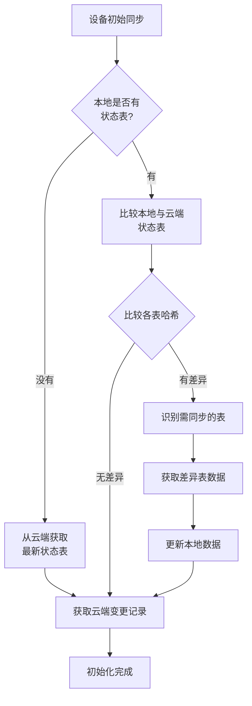

```mermaid
flowchart TD
    Start[设备初始同步] --> CheckLocalState{本地是否有\n状态表?}
    
    CheckLocalState -- 没有 --> FetchCloudState[从云端获取\n最新状态表]
    CheckLocalState -- 有 --> CompareCloudState[比较本地与云端\n状态表]
    
    FetchCloudState --> FetchChangeRecords[获取云端变更记录]
    CompareCloudState --> TableDifference{比较各表哈希}
    
    TableDifference -- 有差异 --> IdentifyTables[识别需同步的表]
    TableDifference -- 无差异 --> FetchChangeRecords
    
    IdentifyTables --> FetchTableData[获取差异表数据]
    FetchTableData --> UpdateLocalData[更新本地数据]
    UpdateLocalData --> FetchChangeRecords
    
    FetchChangeRecords --> End[初始化完成]
```