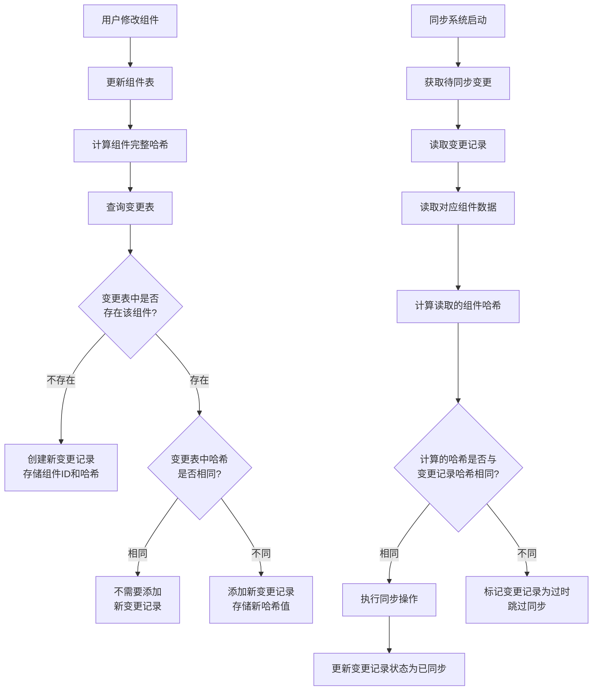

```mermaid
flowchart TD
    A[用户修改组件] --> B[更新组件表]
    B --> C[计算组件完整哈希]
    C --> D[查询变更表]
    
    D --> E{变更表中是否\n存在该组件?}
    E -->|不存在| F[创建新变更记录\n存储组件ID和哈希]
    E -->|存在| G{变更表中哈希\n是否相同?}
    
    G -->|相同| H[不需要添加\n新变更记录]
    G -->|不同| I[添加新变更记录\n存储新哈希值]
    
    J[同步系统启动] --> K[获取待同步变更]
    K --> L[读取变更记录]
    L --> M[读取对应组件数据]
    M --> N[计算读取的组件哈希]
    
    N --> O{计算的哈希是否与\n变更记录哈希相同?}
    O -->|相同| P[执行同步操作]
    O -->|不同| Q[标记变更记录为过时\n跳过同步]
    
    P --> R[更新变更记录状态为已同步]
```