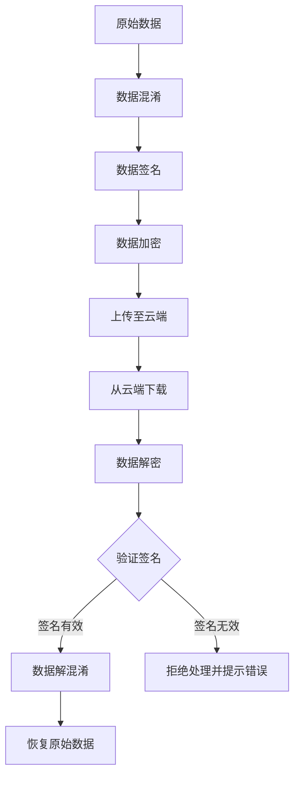

```mermaid
graph TD
    A[原始数据] --> B[数据混淆]
    B --> C[数据签名]
    C --> D[数据加密]
    D --> E[上传至云端]
    E --> F[从云端下载]
    F --> G[数据解密]
    G --> H{验证签名}
    H -->|签名有效| I[数据解混淆]
    H -->|签名无效| J[拒绝处理并提示错误]
    I --> K[恢复原始数据]
```