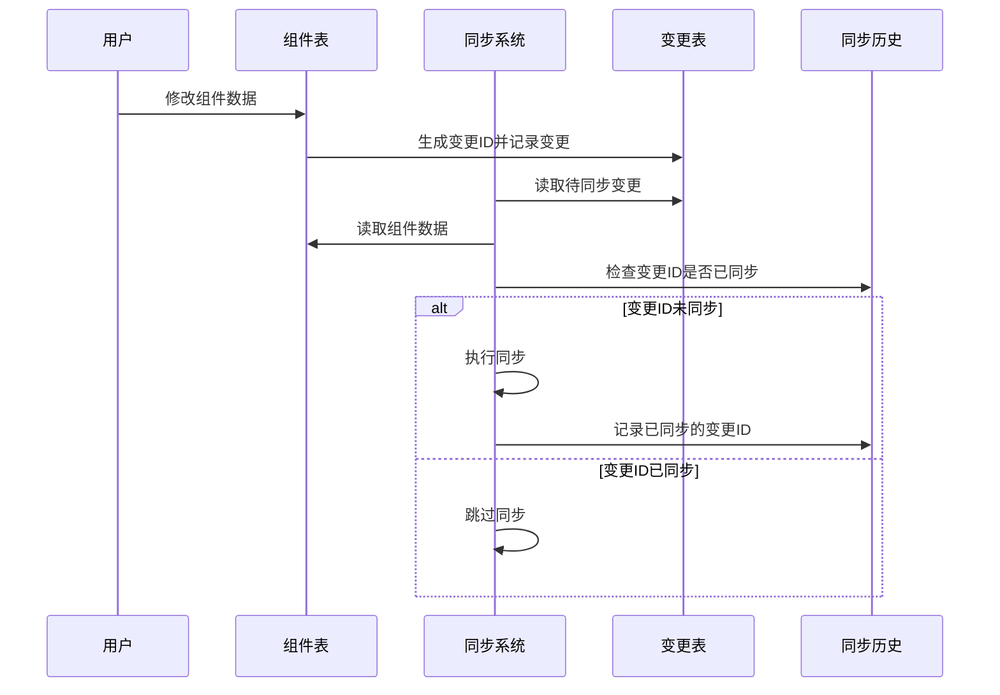

```mermaid
sequenceDiagram
    participant 用户
    participant 组件表
    participant 同步系统
    participant 变更表
    participant 同步历史
    
    用户->>组件表: 修改组件数据
    组件表->>变更表: 生成变更ID并记录变更
    
    同步系统->>变更表: 读取待同步变更
    同步系统->>组件表: 读取组件数据
    同步系统->>同步历史: 检查变更ID是否已同步
    
    alt 变更ID未同步
        同步系统->>同步系统: 执行同步
        同步系统->>同步历史: 记录已同步的变更ID
    else 变更ID已同步
        同步系统->>同步系统: 跳过同步
    end
```