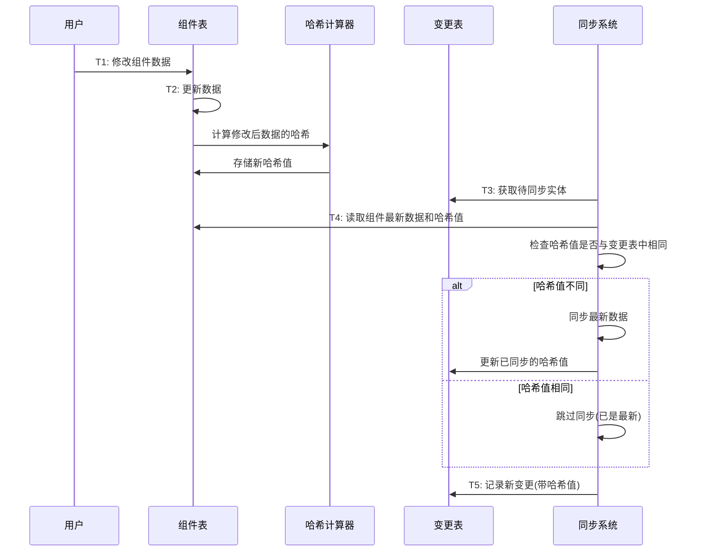

```mermaid
sequenceDiagram
    participant 用户
    participant 组件表
    participant 哈希计算器
    participant 变更表
    participant 同步系统
    
    用户->>组件表: T1: 修改组件数据
    组件表->>组件表: T2: 更新数据
    组件表->>哈希计算器: 计算修改后数据的哈希
    哈希计算器->>组件表: 存储新哈希值
    
    同步系统->>变更表: T3: 获取待同步实体
    同步系统->>组件表: T4: 读取组件最新数据和哈希值
    
    同步系统->>同步系统: 检查哈希值是否与变更表中相同
    
    alt 哈希值不同
        同步系统->>同步系统: 同步最新数据
        同步系统->>变更表: 更新已同步的哈希值
    else 哈希值相同
        同步系统->>同步系统: 跳过同步(已是最新)
    end
    
    同步系统->>变更表: T5: 记录新变更(带哈希值)
```