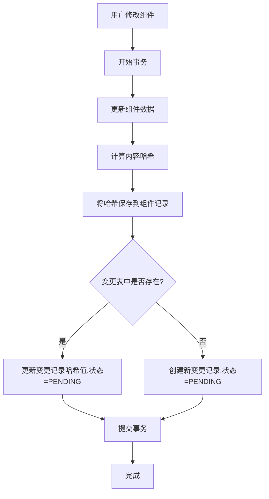

```mermaid
flowchart TD
    Start[用户修改组件] --> StartTransaction[开始事务]
    StartTransaction --> UpdateComponent[更新组件数据]
    UpdateComponent --> CalcHash[计算内容哈希]
    CalcHash --> SaveHash[将哈希保存到组件记录]
    SaveHash --> CheckExists{变更表中是否存在?}
    
    CheckExists -- 是 --> UpdateChange[更新变更记录哈希值,状态=PENDING]
    CheckExists -- 否 --> CreateChange[创建新变更记录,状态=PENDING]
    
    UpdateChange --> CommitTransaction[提交事务]
    CreateChange --> CommitTransaction
    CommitTransaction --> End[完成]
```