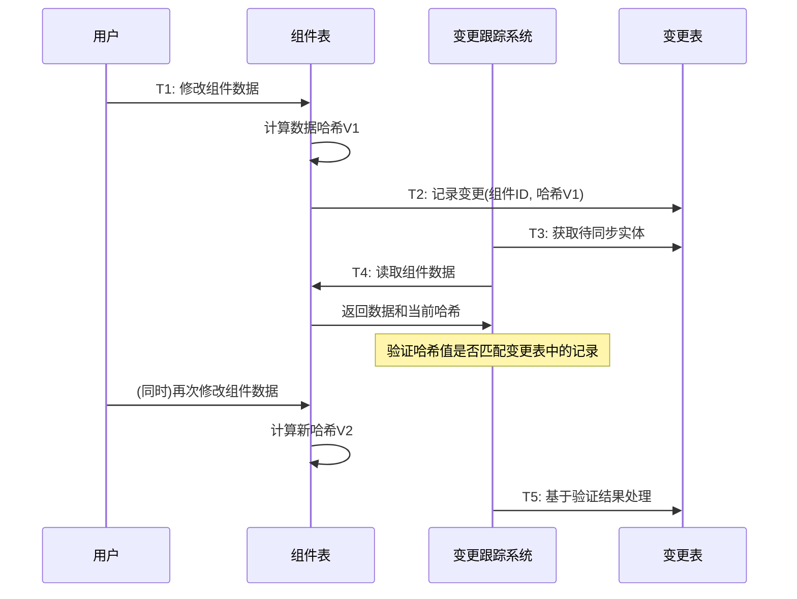

```mermaid
sequenceDiagram
    participant 用户
    participant 组件表
    participant 变更跟踪系统
    participant 变更表
    
    用户->>组件表: T1: 修改组件数据
    组件表->>组件表: 计算数据哈希V1
    组件表->>变更表: T2: 记录变更(组件ID, 哈希V1)
    
    变更跟踪系统->>变更表: T3: 获取待同步实体
    变更跟踪系统->>组件表: T4: 读取组件数据
    组件表->>变更跟踪系统: 返回数据和当前哈希
    
    Note over 变更跟踪系统: 验证哈希值是否匹配变更表中的记录
    
    用户->>组件表: (同时)再次修改组件数据
    组件表->>组件表: 计算新哈希V2
    
    变更跟踪系统->>变更表: T5: 基于验证结果处理
```