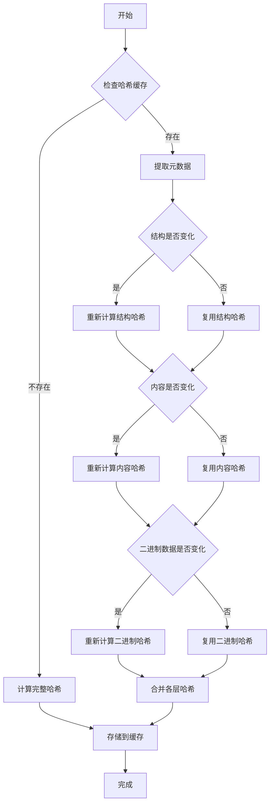

```mermaid
flowchart TD
    Start[开始] --> CheckCache{检查哈希缓存}
    CheckCache -->|存在| ExtractMeta[提取元数据]
    CheckCache -->|不存在| FullHash[计算完整哈希]
    
    ExtractMeta --> CheckStructure{结构是否变化}
    CheckStructure -->|是| RecalcStructure[重新计算结构哈希]
    CheckStructure -->|否| ReuseStructure[复用结构哈希]
    
    RecalcStructure --> CheckContent{内容是否变化}
    ReuseStructure --> CheckContent
    
    CheckContent -->|是| RecalcContent[重新计算内容哈希]
    CheckContent -->|否| ReuseContent[复用内容哈希]
    
    RecalcContent --> CheckBinary{二进制数据是否变化}
    ReuseContent --> CheckBinary
    
    CheckBinary -->|是| RecalcBinary[重新计算二进制哈希]
    CheckBinary -->|否| ReuseBinary[复用二进制哈希]
    
    RecalcBinary --> Combine[合并各层哈希]
    ReuseBinary --> Combine
    FullHash --> StoreCache[存储到缓存]
    
    Combine --> StoreCache
    StoreCache --> End[完成]
```