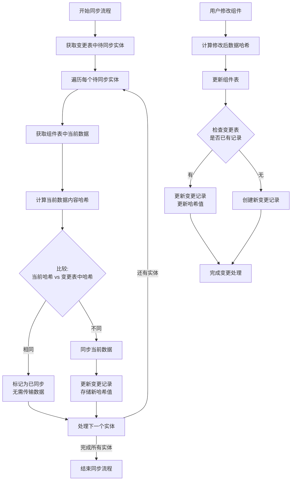

```mermaid
flowchart TD
    Start[开始同步流程] --> FetchChanges[获取变更表中待同步实体]
    FetchChanges --> Loop[遍历每个待同步实体]
    
    Loop --> FetchCurrentData[获取组件表中当前数据]
    FetchCurrentData --> ComputeCurrentHash[计算当前数据内容哈希]
    
    ComputeCurrentHash --> CompareHash{比较:<br/>当前哈希 vs 变更表中哈希}
    
    CompareHash -- 相同 --> MarkSynced[标记为已同步<br/>无需传输数据]
    CompareHash -- 不同 --> SyncData[同步当前数据]
    
    SyncData --> UpdateChangeRecord[更新变更记录<br/>存储新哈希值]
    MarkSynced --> NextEntity[处理下一个实体]
    UpdateChangeRecord --> NextEntity
    
    NextEntity -- 还有实体 --> Loop
    NextEntity -- 完成所有实体 --> End[结束同步流程]
    
    UserChange[用户修改组件] --> CalculateHash[计算修改后数据哈希]
    CalculateHash --> UpdateComponent[更新组件表]
    UpdateComponent --> CheckExistingChange{检查变更表<br/>是否已有记录}
    
    CheckExistingChange -- 有 --> UpdateExistingChange[更新变更记录<br/>更新哈希值]
    CheckExistingChange -- 无 --> CreateNewChange[创建新变更记录]
    
    UpdateExistingChange --> Done[完成变更处理]
    CreateNewChange --> Done
```