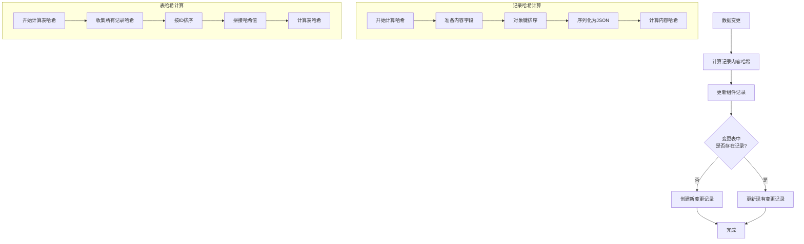

```mermaid
flowchart TD
    Start[数据变更] --> ComputeHash[计算记录内容哈希]
    ComputeHash --> UpdateRecord[更新组件记录]
    UpdateRecord --> CheckChangeRecord{变更表中<br/>是否存在记录?}
    
    CheckChangeRecord -- 否 --> CreateChange[创建新变更记录]
    CheckChangeRecord -- 是 --> UpdateChange[更新现有变更记录]
    
    CreateChange --> End[完成]
    UpdateChange --> End
    
    subgraph 记录哈希计算
    ComputeHashStart[开始计算哈希] --> PrepareContent[准备内容字段]
    PrepareContent --> SortKeys[对象键排序]
    SortKeys --> Serialize[序列化为JSON]
    Serialize --> HashContent[计算内容哈希]
    end
    
    subgraph 表哈希计算
    TableHashStart[开始计算表哈希] --> CollectHashes[收集所有记录哈希]
    CollectHashes --> SortRecords[按ID排序]
    SortRecords --> ConcatHashes[拼接哈希值]
    ConcatHashes --> HashTable[计算表哈希]
    end
```