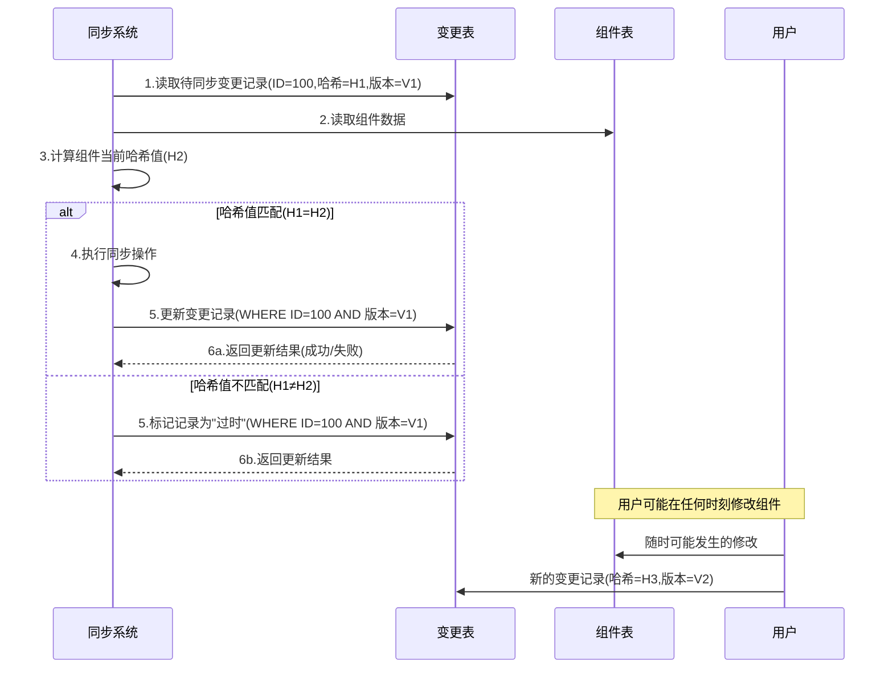

```mermaid
sequenceDiagram
    participant 同步系统
    participant 变更表
    participant 组件表
    participant 用户
    
    同步系统->>变更表: 1.读取待同步变更记录(ID=100,哈希=H1,版本=V1)
    同步系统->>组件表: 2.读取组件数据
    同步系统->>同步系统: 3.计算组件当前哈希值(H2)
    
    alt 哈希值匹配(H1=H2)
        同步系统->>同步系统: 4.执行同步操作
        同步系统->>变更表: 5.更新变更记录(WHERE ID=100 AND 版本=V1)
        变更表-->>同步系统: 6a.返回更新结果(成功/失败)
    else 哈希值不匹配(H1≠H2)
        同步系统->>变更表: 5.标记记录为"过时"(WHERE ID=100 AND 版本=V1)
        变更表-->>同步系统: 6b.返回更新结果
    end
    
    Note over 用户,组件表: 用户可能在任何时刻修改组件
    用户->>组件表: 随时可能发生的修改
    用户->>变更表: 新的变更记录(哈希=H3,版本=V2)
```