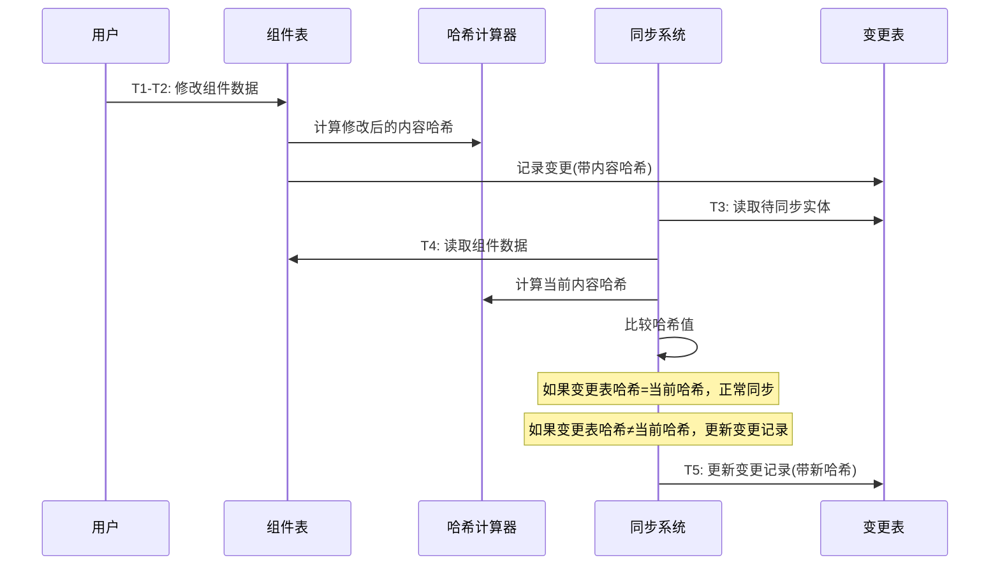

```mermaid
sequenceDiagram
    participant 用户
    participant 组件表
    participant 哈希计算器
    participant 同步系统
    participant 变更表
    
    用户->>组件表: T1-T2: 修改组件数据
    组件表->>哈希计算器: 计算修改后的内容哈希
    组件表->>变更表: 记录变更(带内容哈希)
    
    同步系统->>变更表: T3: 读取待同步实体
    同步系统->>组件表: T4: 读取组件数据
    同步系统->>哈希计算器: 计算当前内容哈希
    
    同步系统->>同步系统: 比较哈希值
    Note over 同步系统: 如果变更表哈希=当前哈希，正常同步
    Note over 同步系统: 如果变更表哈希≠当前哈希，更新变更记录
    
    同步系统->>变更表: T5: 更新变更记录(带新哈希)
```