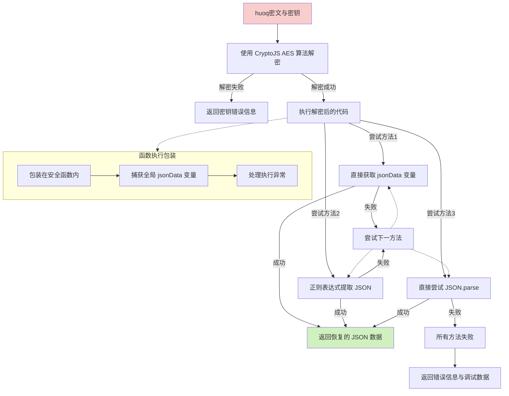

```mermaid

flowchart TD
    A[huoq密文与密钥] --> B[使用 CryptoJS AES 算法解密]
    B -->|解密失败| C[返回密钥错误信息]
    B -->|解密成功| D[执行解密后的代码]
    
    D -->|尝试方法1| E[直接获取 jsonData 变量]
    D -->|尝试方法2| F[正则表达式提取 JSON]
    D -->|尝试方法3| G[直接尝试 JSON.parse]
    
    E -->|成功| H[返回恢复的 JSON 数据]
    F -->|成功| H
    G -->|成功| H
    
    E -->|失败| I[尝试下一方法]
    F -->|失败| I
    G -->|失败| J[所有方法失败]
    
    I -.-> E
    I -.-> F
    I -.-> G
    
    J --> K[返回错误信息与调试数据]
    
    subgraph 函数执行包装
    D1[包装在安全函数内] --> D2[捕获全局 jsonData 变量]
    D2 --> D3[处理执行异常]
    end
    
    D -.-> 函数执行包装
    
    style A fill:#f8cecc
    style H fill:#d0f0c0

```