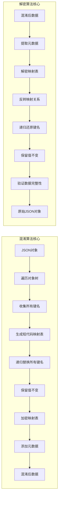

```mermaid
flowchart LR
    subgraph 混淆算法核心
        A1[JSON对象] --> B1[遍历对象树]
        B1 --> C1[收集所有键名]
        C1 --> D1[生成短代码映射表]
        D1 --> E1[递归替换所有键名]
        E1 --> F1[保留值不变]
        F1 --> G1[加密映射表]
        G1 --> H1[添加元数据]
        H1 --> I1[混淆后数据]
    end
    
    subgraph 解密算法核心
        A2[混淆后数据] --> B2[提取元数据]
        B2 --> C2[解密映射表]
        C2 --> D2[反转映射关系]
        D2 --> E2[递归还原键名]
        E2 --> F2[保留值不变]
        F2 --> G2[验证数据完整性]
        G2 --> H2[原始JSON对象]
    end
```