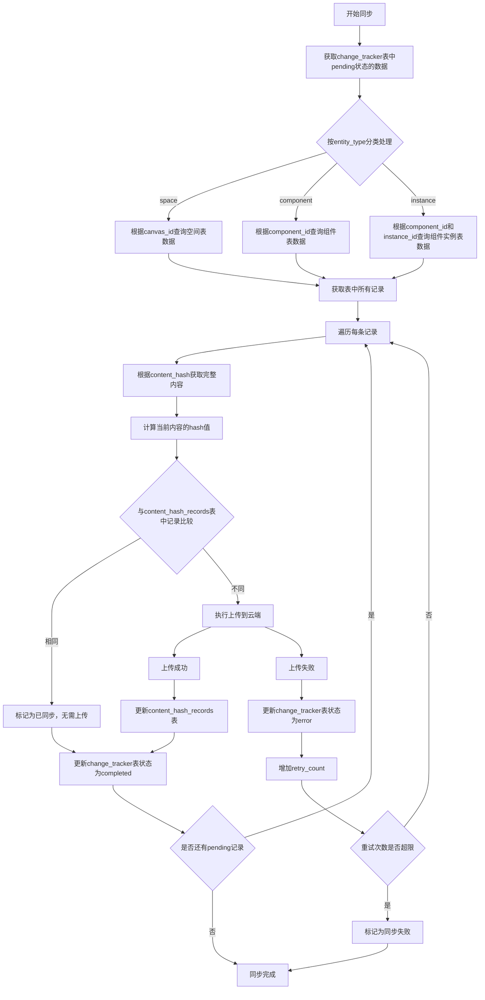

```mermaid
flowchart TD
    A[开始同步] --> B[获取change_tracker表中pending状态的数据]
    B --> C{按entity_type分类处理}
    
    C -->|space| D1[根据canvas_id查询空间表数据]
    C -->|component| D2[根据component_id查询组件表数据]
    C -->|instance| D3[根据component_id和instance_id查询组件实例表数据]
    
    D1 --> E[获取表中所有记录]
    D2 --> E
    D3 --> E
    
    E --> F[遍历每条记录]
    F --> G[根据content_hash获取完整内容]
    G --> H[计算当前内容的hash值]
    
    H --> I{与content_hash_records表中记录比较}
    I -->|相同| J[标记为已同步，无需上传]
    I -->|不同| K[执行上传到云端]
    
    K --> L[上传成功]
    L --> M[更新content_hash_records表]
    M --> N[更新change_tracker表状态为completed]
    
    J --> N
    
    N --> O{是否还有pending记录}
    O -->|是| F
    O -->|否| P[同步完成]
    
    K --> Q[上传失败]
    Q --> R[更新change_tracker表状态为error]
    R --> S[增加retry_count]
    S --> T{重试次数是否超限}
    T -->|是| U[标记为同步失败]
    T -->|否| F
    
    U --> P
```