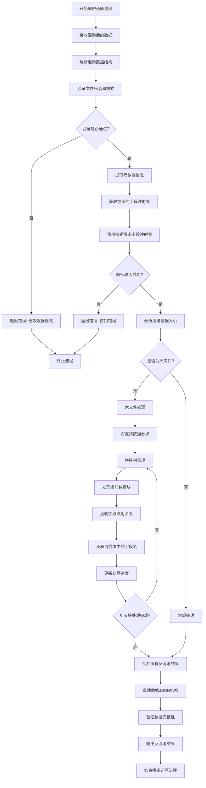

```mermaid
flowchart TD
    A[开始解密还原流程] --> B[接收混淆后的数据]
    
    B --> C[解析混淆数据结构]
    C --> D[验证文件签名和格式]
    
    D --> E{验证是否通过?}
    E -->|否| F[抛出错误: 无效数据格式]
    F --> Z[终止流程]
    
    E -->|是| G[提取元数据信息]
    G --> H[获取加密的字段映射表]
    H --> I[使用密钥解密字段映射表]
    
    I --> J{解密是否成功?}
    J -->|否| K[抛出错误: 密钥错误]
    K --> Z
    
    J -->|是| L[分析混淆数据大小]
    L --> M{是否为大文件?}
    
    M -->|否| N[常规处理]
    M -->|是| O[大文件处理]
    
    O --> O1[将混淆数据分块]
    O1 --> O2[块队列管理]
    
    O2 --> P[处理当前数据块]
    P --> Q[反转字段映射关系]
    Q --> R[还原当前块中的字段名]
    R --> S[更新处理进度]
    S --> T{所有块处理完成?}
    T -->|否| O2
    
    T -->|是| U[合并所有反混淆结果]
    N --> U
    
    U --> V[重建原始JSON结构]
    V --> W[验证数据完整性]
    
    W --> X[输出反混淆结果]
    X --> Y[结束解密还原流程]
```