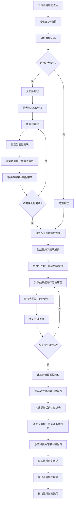

```mermaid
flowchart TD
    A[开始混淆加密流程] --> B[接收JSON数据]
    
    B --> C[分析数据大小]
    C --> D{是否为大文件?}
    
    D -->|否| E[常规处理]
    D -->|是| F[大文件处理]
    
    F --> F1[将大型JSON分块]
    F1 --> F2[块队列管理]
    
    F2 --> G[处理当前数据块]
    G --> H[收集数据块中所有字段名]
    H --> I[逐块构建字段映射字典]
    I --> J{所有块处理完成?}
    J -->|否| F2
    
    J -->|是| K[合并所有字段映射结果]
    E --> K
    
    K --> L[生成最终字段映射表]
    L --> M[为每个字段生成短代码替换]
    
    M --> N[对原始数据进行分块处理]
    N --> O[替换当前块中的字段名]
    O --> P[更新处理进度]
    P --> Q{所有块处理完成?}
    Q -->|否| N
    
    Q -->|是| R[计算原始数据校验和]
    R --> S[使用AES加密字段映射表]
    
    S --> T[构建混淆后的完整结构]
    T --> U[添加元数据、签名和版本信息]
    U --> V[添加加密后的字段映射表]
    V --> W[添加混淆后的数据]
    
    W --> X[输出混淆加密结果]
    X --> Y[结束混淆加密流程]
```