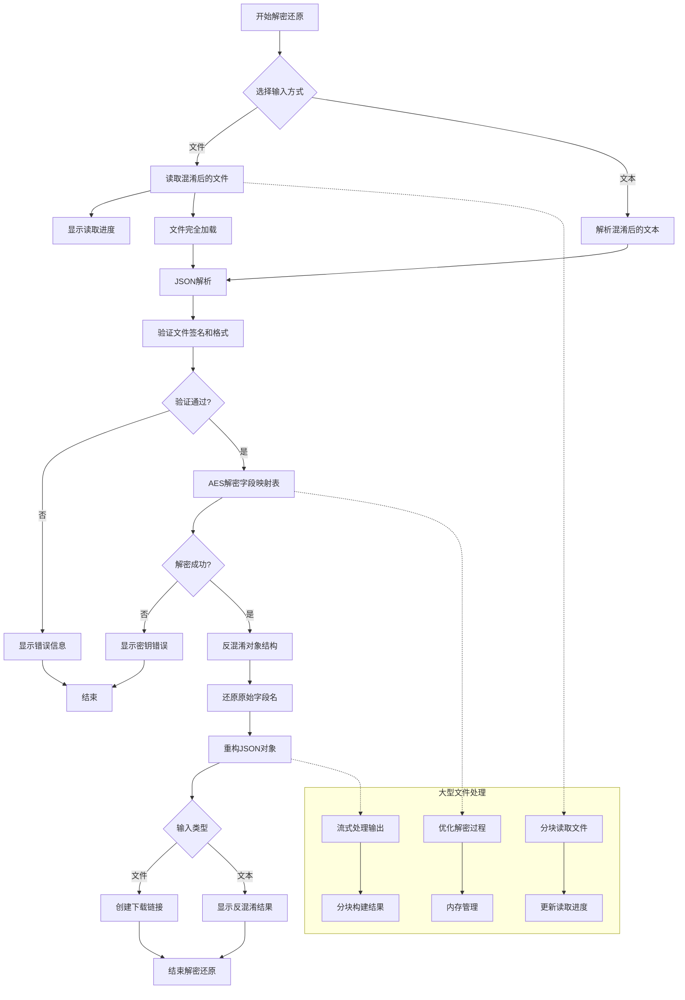

```mermaid
flowchart TD
    A[开始解密还原] --> B{选择输入方式}
    B -->|文件| C[读取混淆后的文件]
    B -->|文本| D[解析混淆后的文本]
    
    C --> E[显示读取进度]
    C --> F[文件完全加载]
    F --> G[JSON解析]
    
    D --> G
    
    G --> H[验证文件签名和格式]
    H --> I{验证通过?}
    I -->|否| J[显示错误信息]
    J --> Z[结束]
    
    I -->|是| K[AES解密字段映射表]
    K --> L{解密成功?}
    L -->|否| M[显示密钥错误]
    M --> Z
    
    L -->|是| N[反混淆对象结构]
    N --> O[还原原始字段名]
    O --> P[重构JSON对象]
    
    P --> Q{输入类型}
    Q -->|文件| R[创建下载链接]
    Q -->|文本| S[显示反混淆结果]
    
    R --> T[结束解密还原]
    S --> T
    
    subgraph 大型文件处理
        C1[分块读取文件] --> C2[更新读取进度]
        K1[优化解密过程] --> K2[内存管理]
        P1[流式处理输出] --> P2[分块构建结果]
    end
    
    C -.-> C1
    K -.-> K1
    P -.-> P1
```