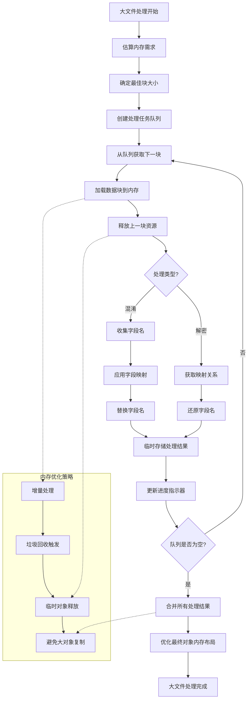

```mermaid
flowchart TD
    A[大文件处理开始] --> B[估算内存需求]
    B --> C[确定最佳块大小]
    C --> D[创建处理任务队列]
    
    D --> E[从队列获取下一块]
    E --> F[加载数据块到内存]
    F --> G[释放上一块资源]
    
    G --> H{处理类型?}
    
    H -->|混淆| I1[收集字段名]
    I1 --> I2[应用字段映射]
    I2 --> I3[替换字段名]
    
    H -->|解密| J1[获取映射关系]
    J1 --> J2[还原字段名]
    
    I3 --> K[临时存储处理结果]
    J2 --> K
    
    K --> L[更新进度指示器]
    L --> M{队列是否为空?}
    M -->|否| E
    
    M -->|是| N[合并所有处理结果]
    N --> O[优化最终对象内存布局]
    O --> P[大文件处理完成]
    
    subgraph 内存优化策略
        Q1[增量处理] --> Q2[垃圾回收触发]
        Q2 --> Q3[临时对象释放]
        Q3 --> Q4[避免大对象复制]
    end
    
    F -.-> Q1
    G -.-> Q3
    N -.-> Q4
```