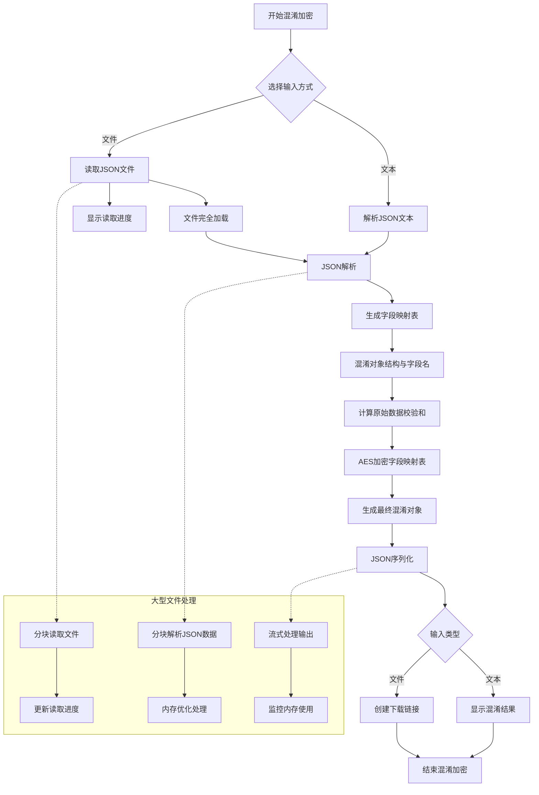

```mermaid
flowchart TD
    A[开始混淆加密] --> B{选择输入方式}
    B -->|文件| C[读取JSON文件]
    B -->|文本| D[解析JSON文本]
    
    C --> E[显示读取进度]
    C --> F[文件完全加载]
    F --> G[JSON解析]
    
    D --> G
    
    G --> H[生成字段映射表]
    H --> I[混淆对象结构与字段名]
    I --> J[计算原始数据校验和]
    J --> K[AES加密字段映射表]
    
    K --> L[生成最终混淆对象]
    L --> M[JSON序列化]
    
    M --> N{输入类型}
    N -->|文件| O[创建下载链接]
    N -->|文本| P[显示混淆结果]
    
    O --> Q[结束混淆加密]
    P --> Q
    
    subgraph 大型文件处理
        C1[分块读取文件] --> C2[更新读取进度]
        G1[分块解析JSON数据] --> G2[内存优化处理]
        M1[流式处理输出] --> M2[监控内存使用]
    end
    
    C -.-> C1
    G -.-> G1
    M -.-> M1
```