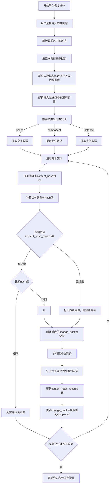

```mermaid
flowchart TD
    A[开始导入恢复操作] --> B[用户选择导入的数据包]
    B --> C[解析数据包中的数据]
    
    C --> D[清空本地相关数据表]
    D --> E[将导入数据包的数据导入本地数据库]
    
    E --> F[解析导入数据包中的所有实体]
    F --> G[按实体类型分类处理]
    
    G -->|space| H1[提取空间数据]
    G -->|component| H2[提取组件数据]
    G -->|instance| H3[提取实例数据]
    
    H1 --> I[遍历每个实体]
    H2 --> I
    H3 --> I
    
    I --> J[提取实体的content_hash列表]
    J --> K[计算实体的整体hash值]
    
    K --> L{查询后端content_hash_records表}
    L -->|无记录| M1[标记为新实体，需完整同步]
    L -->|有记录| M2{比较hash值}
    
    M2 -->|相同| M3[无需同步该实体]
    M2 -->|不同| M4[是]
    
    M4 --> N1[创建对应的change_tracker记录]
    M1 --> N1
    
    N1 --> O[执行选择性同步]
    O --> P[只上传有变化的数据到云端]
    
    P --> Q[更新content_hash_records表]
    Q --> R[更新change_tracker表状态为completed]
    
    M3 --> S{是否已处理所有实体}
    R --> S
    
    S -->|否| I
    S -->|是| T[完成导入和云同步操作]
```