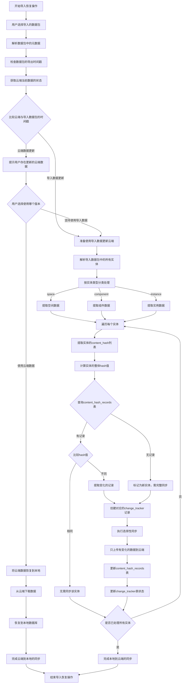

```mermaid
flowchart TD
    A[开始导入恢复操作] --> B[用户选择导入的数据包]
    B --> C[解析数据包中的元数据]
    C --> D[检查数据包的导出时间戳]
    
    D --> E[获取云端当前数据的状态]
    E --> F{比较云端与导入数据包的时间戳}
    
    F -->|导入数据更新| G1[准备使用导入数据更新云端]
    F -->|云端数据更新| G2[提示用户存在更新的云端数据]
    G2 --> G3{用户选择使用哪个版本}
    G3 -->|坚持使用导入数据| G1
    G3 -->|使用云端数据| G4[将云端数据恢复到本地]
    
    G1 --> H[解析导入数据包中的所有实体]
    H --> I[按实体类型分类处理]
    
    I -->|space| J1[提取空间数据]
    I -->|component| J2[提取组件数据]
    I -->|instance| J3[提取实例数据]
    
    J1 --> K[遍历每个实体]
    J2 --> K
    J3 --> K
    
    K --> L[提取实体的content_hash列表]
    L --> M[计算实体的整体hash值]
    
    M --> N{查询content_hash_records表}
    N -->|无记录| O1[标记为新实体，需完整同步]
    N -->|有记录| O2{比较hash值}
    
    O2 -->|相同| O3[无需同步该实体]
    O2 -->|不同| O4[提取变化的记录]
    
    O4 --> P1[创建对应的change_tracker记录]
    O1 --> P1
    
    P1 --> Q[执行选择性同步]
    Q --> R[只上传有变化的数据到云端]
    
    R --> S[更新content_hash_records表]
    S --> T[更新change_tracker表状态]
    
    O3 --> U{是否已处理所有实体}
    T --> U
    
    G4 --> V[从云端下载数据]
    V --> W[恢复到本地数据库]
    W --> X[完成云端到本地的同步]
    
    U -->|否| K
    U -->|是| Y[完成本地到云端的同步]
    
    X --> Z[结束导入恢复操作]
    Y --> Z
```