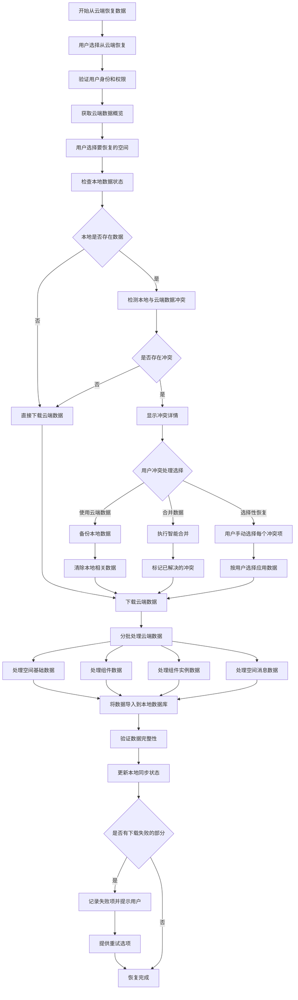

```mermaid
flowchart TD
    A[开始从云端恢复数据] --> B[用户选择从云端恢复]
    B --> C[验证用户身份和权限]
    
    C --> D[获取云端数据概览]
    D --> E[用户选择要恢复的空间]
    
    E --> F[检查本地数据状态]
    F --> G{本地是否存在数据}
    
    G -->|否| H1[直接下载云端数据]
    G -->|是| H2[检测本地与云端数据冲突]
    
    H2 --> I{是否存在冲突}
    I -->|否| H1
    I -->|是| J[显示冲突详情]
    
    J --> K{用户冲突处理选择}
    K -->|使用云端数据| L1[备份本地数据]
    K -->|合并数据| L2[执行智能合并]
    K -->|选择性恢复| L3[用户手动选择每个冲突项]
    
    L1 --> M1[清除本地相关数据]
    L2 --> M2[标记已解决的冲突]
    L3 --> M3[按用户选择应用数据]
    
    M1 --> N[下载云端数据]
    M2 --> N
    M3 --> N
    
    H1 --> N
    
    N --> O[分批处理云端数据]
    O --> P1[处理空间基础数据]
    O --> P2[处理组件数据]
    O --> P3[处理组件实例数据]
    O --> P4[处理空间消息数据]
    
    P1 --> Q[将数据导入到本地数据库]
    P2 --> Q
    P3 --> Q
    P4 --> Q
    
    Q --> R[验证数据完整性]
    R --> S[更新本地同步状态]
    
    S --> T{是否有下载失败的部分}
    T -->|是| U[记录失败项并提示用户]
    T -->|否| V[恢复完成]
    
    U --> W[提供重试选项]
    W --> V
```