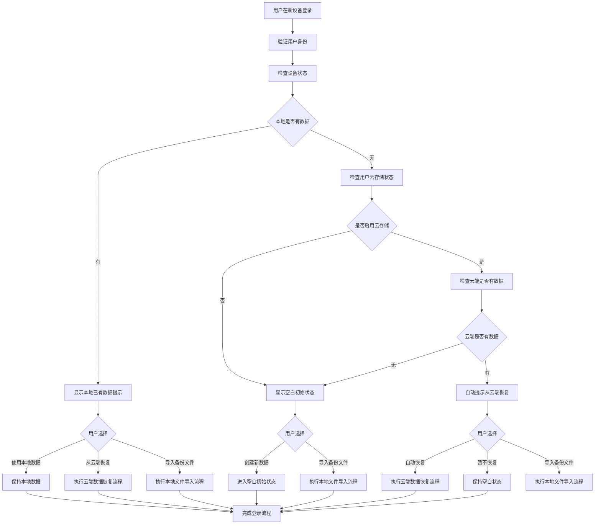

```mermaid
flowchart TD
    A[用户在新设备登录] --> B[验证用户身份]
    B --> C[检查设备状态]
    
    C --> D{本地是否有数据}
    D -->|有| E[显示本地已有数据提示]
    D -->|无| F[检查用户云存储状态]
    
    F --> G{是否启用云存储}
    G -->|否| H[显示空白初始状态]
    G -->|是| I[检查云端是否有数据]
    
    I --> J{云端是否有数据}
    J -->|无| H
    J -->|有| K[自动提示从云端恢复]
    
    E --> L{用户选择}
    L -->|使用本地数据| M[保持本地数据]
    L -->|从云端恢复| N[执行云端数据恢复流程]
    L -->|导入备份文件| O[执行本地文件导入流程]
    
    K --> P{用户选择}
    P -->|自动恢复| Q[执行云端数据恢复流程]
    P -->|暂不恢复| R[保持空白状态]
    P -->|导入备份文件| S[执行本地文件导入流程]
    
    H --> T{用户选择}
    T -->|创建新数据| U[进入空白初始状态]
    T -->|导入备份文件| V[执行本地文件导入流程]
    
    M --> W[完成登录流程]
    N --> W
    O --> W
    Q --> W
    R --> W
    U --> W
    V --> W
```