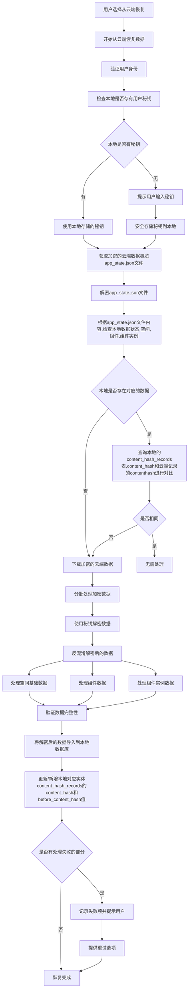

```mermaid


flowchart TD
    A[用户选择从云端恢复] --> B[开始从云端恢复数据]
    B --> C[验证用户身份]
    
    C --> D[检查本地是否存有用户秘钥]
    D --> E{本地是否有秘钥}
    
    E -->|有| F1[使用本地存储的秘钥]
    E -->|无| F2[提示用户输入秘钥]
    F2 --> F7[安全存储秘钥到本地]
    
    F1 --> G[获取加密的云端数据概览app_state.json文件]
    F7 --> G
    
    G --> H[解密app_state.json文件]
    H --> J[根据app_state.json文件内容,检查本地数据状态,空间,组件,组件实例]
    J --> K{本地是否存在对应的数据}
    
    K -->|否| N[下载加密的云端数据]
    K -->|是| L2[查询本地的content_hash_records表,content_hash和云端记录的contenthash进行对比]
    L2 -->  M{是否相同}


    M -->|否| N
    M -->|是| L1[无需处理]
    
    N --> S[分批处理加密数据]
    S --> T[使用秘钥解密数据]
    T --> U[反混淆解密后的数据]
    
    U --> V1[处理空间基础数据]
    U --> V2[处理组件数据]
    U --> V3[处理组件实例数据]

    V1 --> X[验证数据完整性]
    V2 --> X
    V3 --> X
    
    X --> W[将解密后的数据导入到本地数据库]
    
    W --> Y[更新/新增本地对应实体content_hash_records的content_hash和before_content_hash值]
    
    Y --> Z{是否有处理失败的部分}
    Z -->|是| AA[记录失败项并提示用户]
    Z -->|否| AB[恢复完成]
    
    AA --> AC[提供重试选项]
    AC --> AB

```