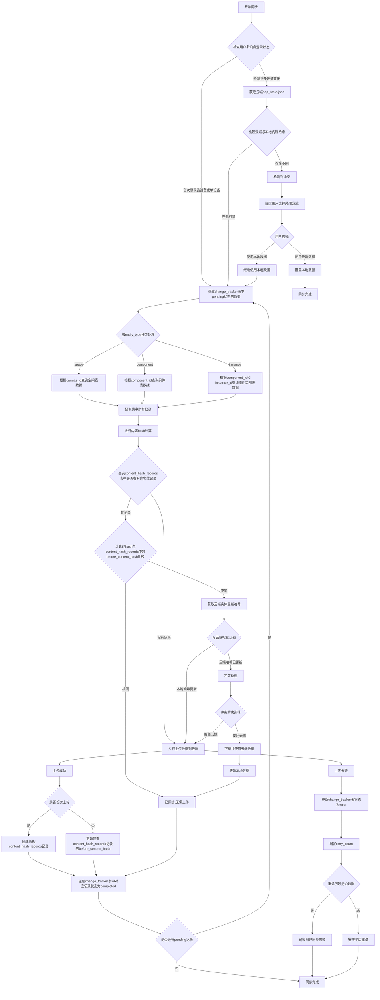

```mermaid
flowchart TD
    A[开始同步] --> LoginCheck{检查用户多设备登录状态}
    LoginCheck -->|首次登录该设备或单设备| B[获取change_tracker表中pending状态的数据]
    LoginCheck -->|检测到多设备登录| FetchCloudState[获取云端app_state.json]
    
    FetchCloudState --> CloudHashCheck{比较云端与本地内容哈希}
    CloudHashCheck -->|存在不同| ConflictDetected[检测到冲突]
    CloudHashCheck -->|完全相同| B
    
    ConflictDetected --> UserPrompt[提示用户选择处理方式]
    UserPrompt --> UserChoice{用户选择}
    UserChoice -->|使用云端数据| OverwriteLocal[覆盖本地数据]
    UserChoice -->|使用本地数据| ContinueLocalSync[继续使用本地数据]
    
    OverwriteLocal --> SyncComplete[同步完成]
    ContinueLocalSync --> B
    
    B --> C{按entity_type分类处理}
    
    C -->|space| D1[根据canvas_id查询空间表数据]
    C -->|component| D2[根据component_id查询组件表数据]
    C -->|instance| D3[根据component_id和instance_id查询组件实例表数据]
    
    D1 --> E1[获取表中所有记录]
    D2 --> E1
    D3 --> E1
    
    E1 --> E2[进行内容hash计算]
    
    E2 --> I1{查询content_hash_records表中是否有对应实体记录}
    I1 -->|没有记录| K[执行上传数据到云端]
    I1 -->|有记录| I2{计算的hash与content_hash_records中的before_content_hash比较}
    I2 -->|相同| J[已同步,无需上传]
    I2 -->|不同| FetchCloudHash[获取云端实体最新哈希]
    
    FetchCloudHash --> CompareWithCloud{与云端哈希比较}
    CompareWithCloud -->|本地哈希更新| K
    CompareWithCloud -->|云端哈希已更新| ConflictResolution[冲突处理]
    
    ConflictResolution --> ResolutionChoice{冲突解决选择}
    ResolutionChoice -->|覆盖云端| K
    ResolutionChoice -->|使用云端| DownloadCloud[下载并使用云端数据]
    
    DownloadCloud --> UpdateLocal[更新本地数据]
    UpdateLocal --> J
    
    K --> L[上传成功]
    K --> Q[上传失败]
    
    L --> M1{是否首次上传}
    M1 -->|是| M2[创建新的content_hash_records记录]
    M1 -->|否| M3[更新现有content_hash_records记录的before_content_hash]
    
    M2 --> N[更新change_tracker表中对应记录状态为completed]
    M3 --> N
    
    J --> N
    
    N --> O{是否还有pending记录}
    O -->|是| B
    O -->|否| P[同步完成]
    
    Q --> R[更新change_tracker表状态为error]
    R --> S[增加retry_count]
    S --> T{重试次数是否超限}
    T -->|是| NotifySync[通知用户同步失败]
    T -->|否| RetryLater[安排稍后重试]
    
    NotifySync --> P
    RetryLater --> P
```