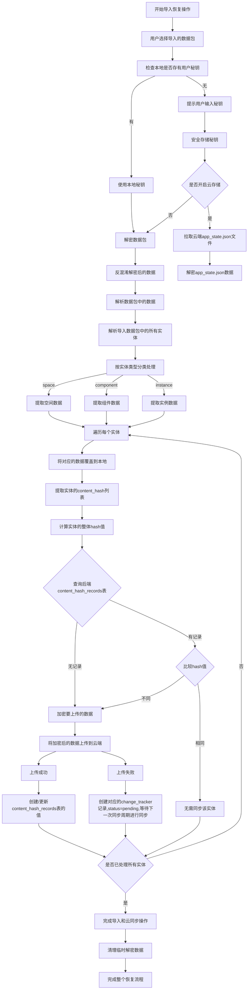

```mermaid

flowchart TD
    A[开始导入恢复操作] --> B[用户选择导入的数据包]
    B --> B1[检查本地是否存有用户秘钥]
    
    B1 -->|有| B3[使用本地秘钥]
    B1 -->|无| B4[提示用户输入秘钥]

    B4 --> B8[安全存储秘钥]
    B3 --> B10[解密数据包]
   

    B8 --> Check{是否开启云存储}
    Check --> |否| B10
    Check --> |是| Download[拉取云端app_state.json文件]
    Download --> AppState[解密app_state.json数据]

    

    B10 --> B11[反混淆解密后的数据]
    B11 --> C[解析数据包中的数据]
    
    C --> D[解析导入数据包中的所有实体]
    D --> G[按实体类型分类处理]
    
    G -->|space| H1[提取空间数据]
    G -->|component| H2[提取组件数据]
    G -->|instance| H3[提取实例数据]
    
    H1 --> I[遍历每个实体]
    H2 --> I
    H3 --> I
    
    I --> Save[将对应的数据覆盖到本地]
    Save --> J[提取实体的content_hash列表]
    J --> K[计算实体的整体hash值]
    
    K --> L{查询后端content_hash_records表}
    L -->|无记录| M1[加密要上传的数据]
    M1 --> M1a[将加密后的数据上传到云端]
    M1a --> N1[上传成功]
    M1a --> N2[上传失败]
    
    N2 --> N3[创建对应的change_tracker记录,status=pending,等待下一次同步周期进行同步]
    N3 --> S
    N1 --> M4[创建/更新content_hash_records表的值]


    L -->|有记录| M2{比较hash值}
    M2 -->|不同| M1

    M2 -->|相同| M3[无需同步该实体]
    
    
    M3 --> S{是否已处理所有实体}
    M4 --> S{是否已处理所有实体}
    
    S -->|否| I
    S -->|是| T[完成导入和云同步操作]
    
    T --> U[清理临时解密数据]
    U --> V[完成整个恢复流程]

```