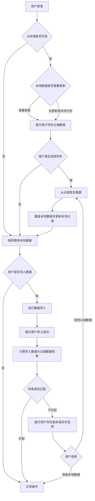

```mermaid
flowchart TD
    A[用户登录] --> B{云存储是否开启}
    B -->|是| C{本地数据是否需要更新}
    B -->|否| D[继续使用本地数据]

    C --> |需要更新| E[提示用户同步云端数据]
    C --> |无更新或本地为空| E

    E --> F{用户是否选择同步}
    F -->|是| G[从云端恢复数据]
    F -->|否| D

    G --> H[覆盖本地数据并更新本地记录]
    H --> D

    D --> I{用户是否导入数据}
    I --> |是| J[进行数据导入]
    I --> |否| End[正常操作]

    J --> K[提示用户导入成功]
    K --> L[计算导入数据与云端数据哈希]
    L --> M{哈希是否匹配}

    M -->|匹配| End
    M -->|不匹配| N[提示用户存在版本差异并选择]
    
    N --> O{用户选择}
    O -->|使用云端数据| G
    O -->|保留本地数据| End
```