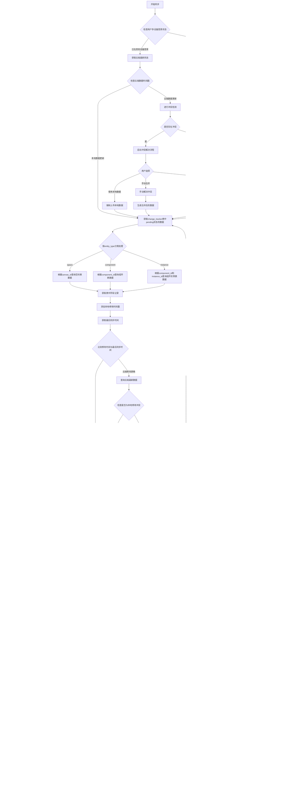

```mermaid
flowchart TD
    A[开始同步] --> LoginCheck{检查用户多设备登录状态}
    LoginCheck -->|首次登录该设备| InitialSync[执行初始同步]
    LoginCheck -->|已在其他设备登录| FetchCloudState[获取云端最新状态]
    
    FetchCloudState --> CloudStateCheck{检查云端数据时间戳}
    CloudStateCheck -->|云端数据更新| ConflictDetection[进行冲突检测]
    CloudStateCheck -->|本地数据更新| B[获取change_tracker表中pending状态的数据]
    
    ConflictDetection --> HasConflict{是否存在冲突}
    HasConflict -->|是| ConflictResolution[启动冲突解决流程]
    HasConflict -->|否| MergeData[合并云端与本地数据]
    
    ConflictResolution --> UserChoice{用户选择}
    UserChoice -->|使用云端数据| OverwriteLocal[覆盖本地数据]
    UserChoice -->|使用本地数据| ForceLocalSync[强制上传本地数据] 
    UserChoice -->|手动合并| ManualMerge[手动解决冲突]
    
    OverwriteLocal --> ClearLocalChanges[清理本地change_tracker]
    ForceLocalSync --> B
    ManualMerge --> UpdatedData[生成合并后的数据]
    
    UpdatedData --> B
    MergeData --> B
    ClearLocalChanges --> DoneClear[完成清理]
    
    InitialSync --> B
    
    B --> C{按entity_type分类处理}
    
    C -->|space| D1[根据canvas_id查询空间表数据]
    C -->|component| D2[根据component_id查询组件表数据]
    C -->|instance| D3[根据component_id和instance_id查询组件实例表数据]
    
    D1 --> E1[获取表中所有记录]
    D2 --> E1
    D3 --> E1
    
    E1 --> AddTimestamp[添加本地修改时间戳]
    AddTimestamp --> FetchLastSyncTime[获取最后同步时间]
    FetchLastSyncTime --> CompareTime{比较修改时间与最后同步时间}
    
    CompareTime -->|本地修改更晚| E2[进行hash计算]
    CompareTime -->|云端修改更晚| CloudDataQuery[查询云端最新数据]
    CloudDataQuery --> ConflictCheck{检查是否与本地修改冲突}
    ConflictCheck -->|有冲突| PromptUser[提示用户选择版本]
    ConflictCheck -->|无冲突| E2
    
    PromptUser --> UserResolve{用户选择}
    UserResolve -->|使用本地| E2
    UserResolve -->|使用云端| SkipSync[跳过此次同步]
    UserResolve -->|合并| MergeChanges[执行数据合并]
    MergeChanges --> E2
    
    E2 --> I1{查询content_hash_records表中是否有对应实体记录}
    I1 -->|没有记录| VersionCheck[检查云端数据版本]
    I1 -->|有记录| I2{计算的hash与content_hash_records中的before_content_hash比较}
    
    VersionCheck --> CreateVersion[创建初始数据版本]
    CreateVersion --> K
    
    I2 -->|相同| J[已同步,无需上传]
    I2 -->|不同| K[执行上传数据到云端]
    
    K --> UploadStatus{同步状态}
    UploadStatus -->|成功| L[上传成功]
    UploadStatus -->|失败| Q[上传失败]
    
    L --> UpdateTimestamp[更新最后同步时间戳]
    UpdateTimestamp --> M1{是否首次上传}
    
    M1 -->|是| M2[创建新的content_hash_records记录]
    M1 -->|否| M3[更新现有content_hash_records记录的before_content_hash]
    
    M2 --> N[更新change_tracker表中对应记录状态为completed]
    M3 --> N
    
    J --> N
    SkipSync --> N
    
    N --> O{是否还有pending记录}
    O -->|是| B
    O -->|否| P[同步完成]
    
    Q --> R[更新change_tracker表状态为error]
    R --> S[增加retry_count]
    S --> T{重试次数是否超限}
    T -->|是| NotifyUser[通知用户同步失败]
    T -->|否| RetryLater[安排稍后重试]
    
    NotifyUser --> P
    RetryLater --> P
    
    DoneClear --> P
```