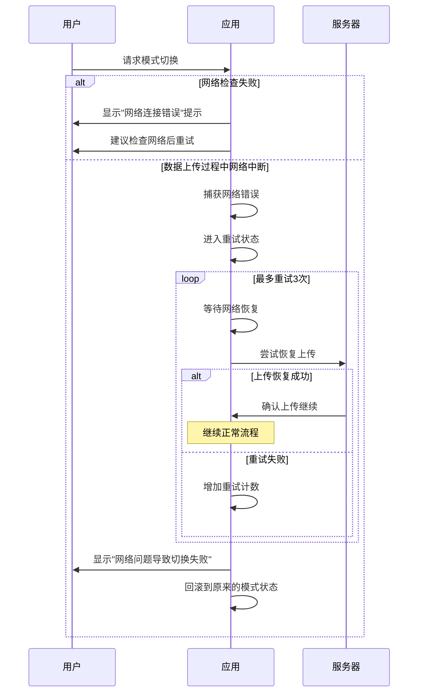

```mermaid
sequenceDiagram
    participant User as 用户
    participant App as 应用
    participant Server as 服务器
    
    User->>App: 请求模式切换
    
    alt 网络检查失败
        App->>User: 显示"网络连接错误"提示
        App->>User: 建议检查网络后重试
    else 数据上传过程中网络中断
        App->>App: 捕获网络错误
        App->>App: 进入重试状态
        loop 最多重试3次
            App->>App: 等待网络恢复
            App->>Server: 尝试恢复上传
            alt 上传恢复成功
                Server->>App: 确认上传继续
                Note over App: 继续正常流程
            else 重试失败
                App->>App: 增加重试计数
            end
        end
        App->>User: 显示"网络问题导致切换失败"
        App->>App: 回滚到原来的模式状态
    end
```