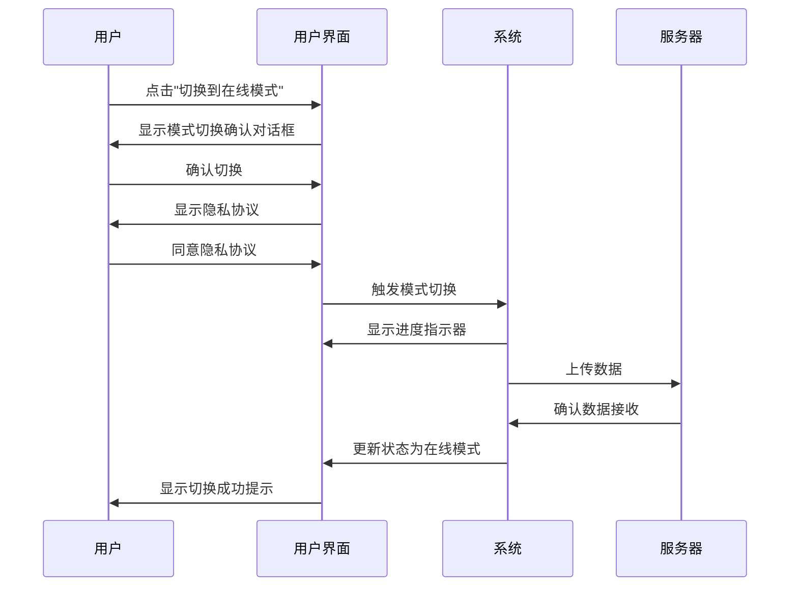

```mermaid
sequenceDiagram
    participant User as 用户
    participant UI as 用户界面
    participant System as 系统
    participant Server as 服务器
    
    User->>UI: 点击"切换到在线模式"
    UI->>User: 显示模式切换确认对话框
    User->>UI: 确认切换
    UI->>User: 显示隐私协议
    User->>UI: 同意隐私协议
    UI->>System: 触发模式切换
    System->>UI: 显示进度指示器
    System->>Server: 上传数据
    Server->>System: 确认数据接收
    System->>UI: 更新状态为在线模式
    UI->>User: 显示切换成功提示
```