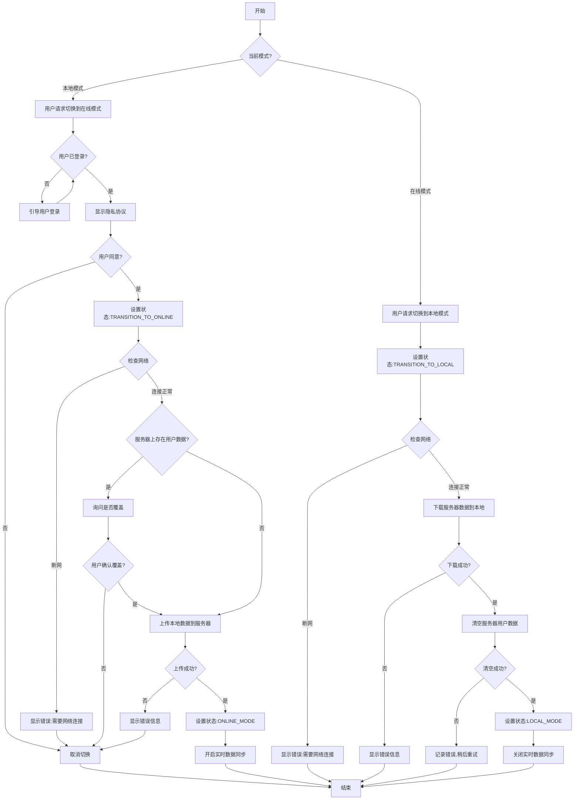

```mermaid
flowchart TD
    A[开始] --> B{当前模式?}
    
    B -->|本地模式| C[用户请求切换到在线模式]
    C --> D{用户已登录?}
    D -->|否| E[引导用户登录]
    E --> D
    D -->|是| F[显示隐私协议]
    F --> G{用户同意?}
    G -->|否| H[取消切换]
    H --> Z[结束]
    G -->|是| I[设置状态:TRANSITION_TO_ONLINE]
    I --> J{检查网络}
    J -->|断网| K[显示错误:需要网络连接]
    K --> H
    J -->|连接正常| L{服务器上存在用户数据?}
    L -->|是| M[询问是否覆盖]
    M --> N{用户确认覆盖?}
    N -->|否| H
    N -->|是| O[上传本地数据到服务器]
    L -->|否| O
    O --> P{上传成功?}
    P -->|否| Q[显示错误信息]
    Q --> H
    P -->|是| R[设置状态:ONLINE_MODE]
    R --> S[开启实时数据同步]
    S --> Z
    
    B -->|在线模式| T[用户请求切换到本地模式]
    T --> U[设置状态:TRANSITION_TO_LOCAL]
    U --> V{检查网络}
    V -->|断网| W[显示错误:需要网络连接]
    W --> Z
    V -->|连接正常| X[下载服务器数据到本地]
    X --> Y{下载成功?}
    Y -->|否| AA[显示错误信息]
    AA --> Z
    Y -->|是| AB[清空服务器用户数据]
    AB --> AC{清空成功?}
    AC -->|否| AD[记录错误,稍后重试]
    AD --> Z
    AC -->|是| AE[设置状态:LOCAL_MODE]
    AE --> AF[关闭实时数据同步]
    AF --> Z
```