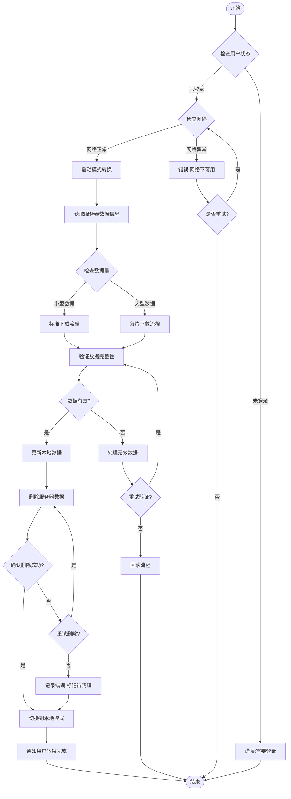

```mermaid
flowchart TD
    Start([开始]) --> CheckStatus{检查用户状态}
    CheckStatus -->|已登录| CheckNetwork{检查网络}
    CheckStatus -->|未登录| Error1[错误:需要登录]
    Error1 --> End([结束])
    
    CheckNetwork -->|网络正常| StartTransition[启动模式转换]
    CheckNetwork -->|网络异常| Error2[错误:网络不可用]
    Error2 --> RetryCheck{是否重试?}
    RetryCheck -->|是| CheckNetwork
    RetryCheck -->|否| End
    
    StartTransition --> GetDataInfo[获取服务器数据信息]
    GetDataInfo --> CheckDataSize{检查数据量}
    
    CheckDataSize -->|小型数据| StandardDownload[标准下载流程]
    CheckDataSize -->|大型数据| ChunkedDownload[分片下载流程]
    
    StandardDownload --> ValidateData[验证数据完整性]
    ChunkedDownload --> ValidateData
    
    ValidateData --> DataValid{数据有效?}
    DataValid -->|是| UpdateLocal[更新本地数据]
    DataValid -->|否| HandleInvalidData[处理无效数据]
    HandleInvalidData --> RetryValidate{重试验证?}
    RetryValidate -->|是| ValidateData
    RetryValidate -->|否| RollbackProcess[回滚流程]
    RollbackProcess --> End
    
    UpdateLocal --> DeleteServerData[删除服务器数据]
    DeleteServerData --> ConfirmDeletion{确认删除成功?}
    ConfirmDeletion -->|是| SwitchMode[切换到本地模式]
    ConfirmDeletion -->|否| RetryDelete{重试删除?}
    RetryDelete -->|是| DeleteServerData
    RetryDelete -->|否| LogError[记录错误,标记待清理]
    LogError --> SwitchMode
    
    SwitchMode --> NotifyUser[通知用户转换完成]
    NotifyUser --> End
```