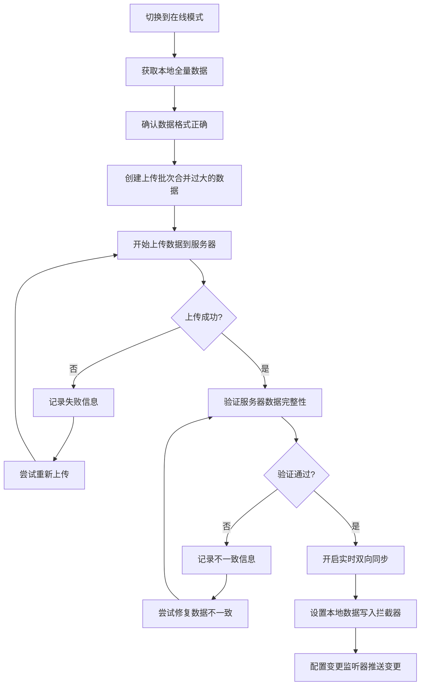

```mermaid
flowchart TD
    A[切换到在线模式] --> B[获取本地全量数据]
    B --> C[确认数据格式正确]
    C --> D[创建上传批次合并过大的数据]
    D --> E[开始上传数据到服务器]
    E --> F{上传成功?}
    F -->|否| G[记录失败信息]
    G --> H[尝试重新上传]
    H --> E
    F -->|是| I[验证服务器数据完整性]
    I --> J{验证通过?}
    J -->|否| K[记录不一致信息]
    K --> L[尝试修复数据不一致]
    L --> I
    J -->|是| M[开启实时双向同步]
    M --> N[设置本地数据写入拦截器]
    N --> O[配置变更监听器推送变更]
```