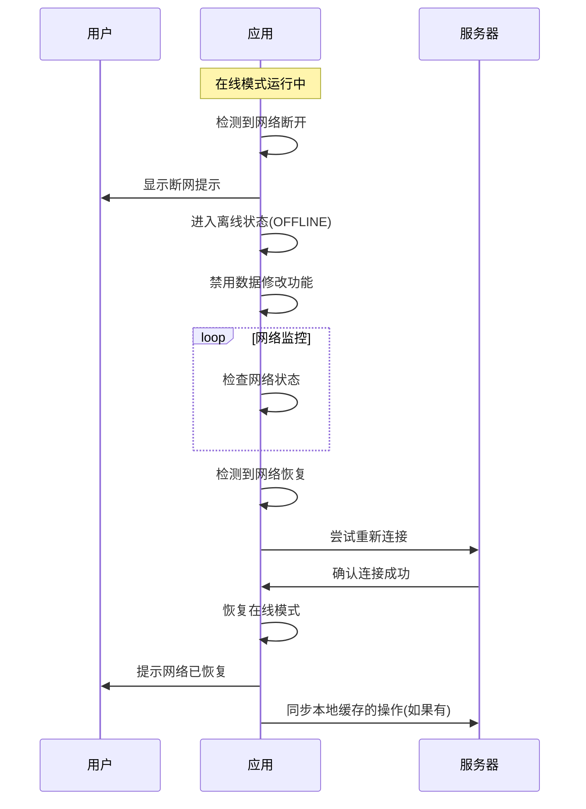

```mermaid
sequenceDiagram
    participant User as 用户
    participant App as 应用
    participant Server as 服务器
    
    Note over App: 在线模式运行中
    
    App->>App: 检测到网络断开
    App->>User: 显示断网提示
    App->>App: 进入离线状态(OFFLINE)
    App->>App: 禁用数据修改功能
    
    loop 网络监控
        App->>App: 检查网络状态
    end
    
    App->>App: 检测到网络恢复
    App->>Server: 尝试重新连接
    Server->>App: 确认连接成功
    
    App->>App: 恢复在线模式
    App->>User: 提示网络已恢复
    App->>Server: 同步本地缓存的操作(如果有)
```