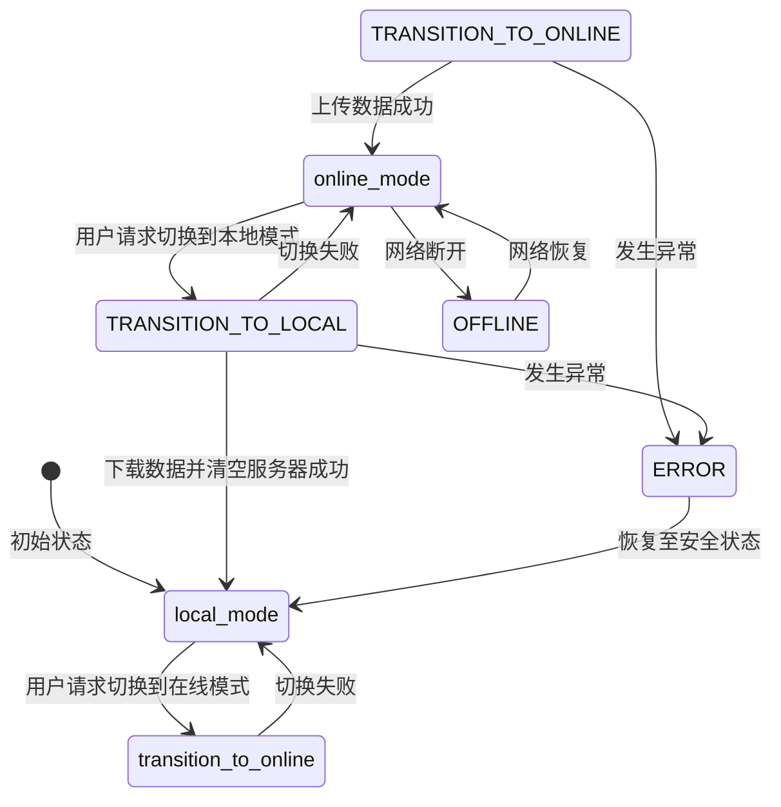

```mermaid
stateDiagram-v2
    [*] --> local_mode: 初始状态
    
    local_mode --> transition_to_online: 用户请求切换到在线模式
    transition_to_online --> local_mode: 切换失败
    TRANSITION_TO_ONLINE --> online_mode: 上传数据成功
    
    online_mode --> TRANSITION_TO_LOCAL: 用户请求切换到本地模式
    TRANSITION_TO_LOCAL --> online_mode: 切换失败
    TRANSITION_TO_LOCAL --> local_mode: 下载数据并清空服务器成功
    
    online_mode --> OFFLINE: 网络断开
    OFFLINE --> online_mode: 网络恢复
    
    TRANSITION_TO_ONLINE --> ERROR: 发生异常
    TRANSITION_TO_LOCAL --> ERROR: 发生异常
    ERROR --> local_mode: 恢复至安全状态
```