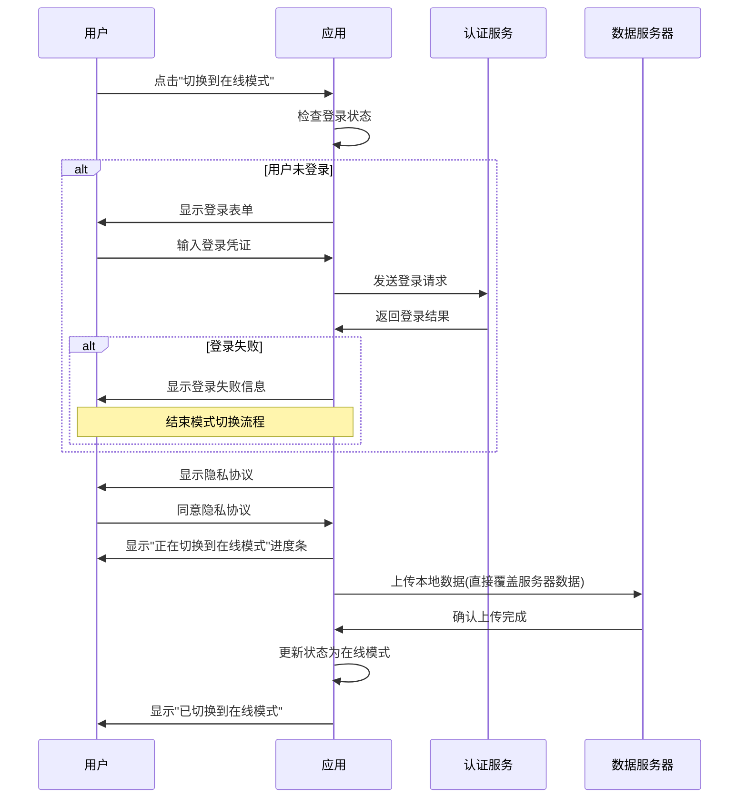

```mermaid
sequenceDiagram
    participant User as 用户
    participant App as 应用
    participant Auth as 认证服务
    participant Server as 数据服务器
    
    User->>App: 点击"切换到在线模式"
    App->>App: 检查登录状态
    
    alt 用户未登录
        App->>User: 显示登录表单
        User->>App: 输入登录凭证
        App->>Auth: 发送登录请求
        Auth->>App: 返回登录结果
        
        alt 登录失败
            App->>User: 显示登录失败信息
            Note over App,User: 结束模式切换流程
        end
    end
    
    App->>User: 显示隐私协议
    User->>App: 同意隐私协议
    
    App->>User: 显示"正在切换到在线模式"进度条
    App->>Server: 上传本地数据(直接覆盖服务器数据)
    Server->>App: 确认上传完成
    
    App->>App: 更新状态为在线模式
    App->>User: 显示"已切换到在线模式"
```