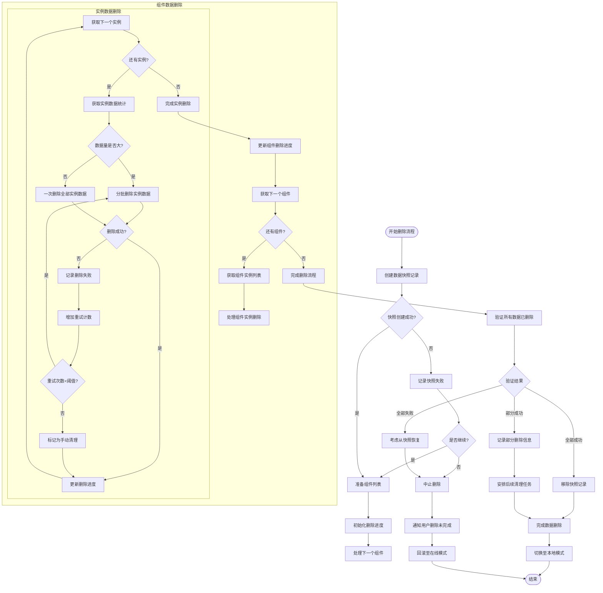

```mermaid
flowchart TD
    Start([开始删除流程]) --> CreateSnapshot[创建数据快照记录]
    CreateSnapshot --> CheckSnapshot{快照创建成功?}
    
    CheckSnapshot -->|否| LogSnapshotFail[记录快照失败]
    LogSnapshotFail --> AskContinue{是否继续?}
    AskContinue -->|否| AbortDeletion[中止删除]
    AskContinue -->|是| PrepareComponentList[准备组件列表]
    
    CheckSnapshot -->|是| PrepareComponentList
    
    PrepareComponentList --> InitDeleteProgress[初始化删除进度]
    InitDeleteProgress --> ProcessNextComponent[处理下一个组件]
    
    subgraph ComponentDeletion [组件数据删除]
        PC1[获取下一个组件] --> PC2{还有组件?}
        PC2 -->|否| CompleteDeletion[完成删除流程]
        PC2 -->|是| PC3[获取组件实例列表]
        
        PC3 --> PC4[处理组件实例删除]
        
        subgraph InstanceDeletion [实例数据删除]
            ID1[获取下一个实例] --> ID2{还有实例?}
            ID2 -->|否| ID8[完成实例删除]
            ID2 -->|是| ID3[获取实例数据统计]
            ID3 --> ID4{数据量是否大?}
            ID4 -->|是| ID5[分批删除实例数据]
            ID4 -->|否| ID6[一次删除全部实例数据]
            ID5 --> ID7{删除成功?}
            ID6 --> ID7
            ID7 -->|是| ID9[更新删除进度]
            ID7 -->|否| ID10[记录删除失败]
            ID10 --> ID11[增加重试计数]
            ID11 --> ID12{重试次数<阈值?}
            ID12 -->|是| ID5
            ID12 -->|否| ID13[标记为手动清理]
            ID13 --> ID9
            ID9 --> ID1
        end
        
        ID8 --> PC5[更新组件删除进度]
        PC5 --> PC1
    end
    
    CompleteDeletion --> VerifyAllDeleted[验证所有数据已删除]
    VerifyAllDeleted --> DeletionResult{验证结果}
    
    DeletionResult -->|全部成功| RemoveSnapshot[移除快照记录]
    DeletionResult -->|部分成功| LogPartialDeletion[记录部分删除信息]
    DeletionResult -->|全部失败| RestoreFromSnapshot[考虑从快照恢复]
    
    LogPartialDeletion --> ScheduleCleanup[安排后续清理任务]
    RestoreFromSnapshot --> AbortDeletion
    
    RemoveSnapshot --> DeletionComplete[完成数据删除]
    ScheduleCleanup --> DeletionComplete
    
    DeletionComplete --> SwitchToLocalMode[切换至本地模式]
    SwitchToLocalMode --> End([结束])
    
    AbortDeletion --> NotifyUser[通知用户删除未完成]
    NotifyUser --> RollbackToOnline[回滚至在线模式]
    RollbackToOnline --> End
```