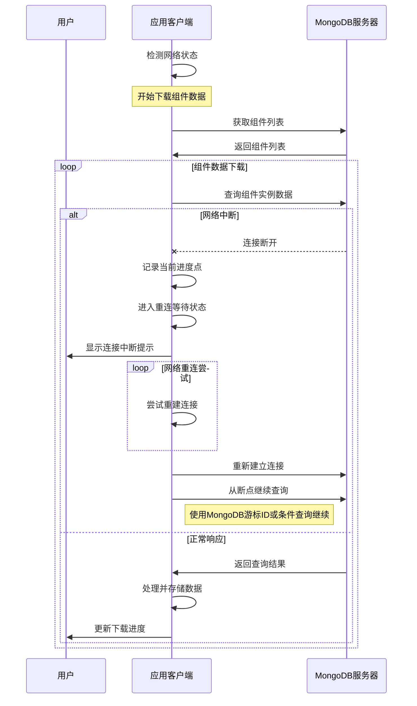

```mermaid
sequenceDiagram
    participant User as 用户
    participant App as 应用客户端
    participant MongoDB as MongoDB服务器
    
    App->>App: 检测网络状态
    
    Note over App: 开始下载组件数据
    
    App->>MongoDB: 获取组件列表
    MongoDB->>App: 返回组件列表
    
    loop 组件数据下载
        App->>MongoDB: 查询组件实例数据
        
        alt 网络中断
            MongoDB--x App: 连接断开
            App->>App: 记录当前进度点
            App->>App: 进入重连等待状态
            App->>User: 显示连接中断提示
            
            loop 网络重连尝试
                App->>App: 尝试重建连接
            end
            
            App->>MongoDB: 重新建立连接
            App->>MongoDB: 从断点继续查询
            note right of App: 使用MongoDB游标ID或条件查询继续
        else 正常响应
            MongoDB->>App: 返回查询结果
            App->>App: 处理并存储数据
            App->>User: 更新下载进度
        end
    end
    
    
```