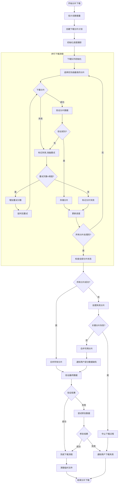

```mermaid
flowchart TD
    Start([开始分片下载]) --> EstimateSize[估计总数据量]
    EstimateSize --> CreateChunks[创建下载分片计划]
    CreateChunks --> InitProgress[初始化进度跟踪]
    InitProgress --> A
    
    subgraph DownloadProcess [并行下载流程]
        A[下载队列初始化] --> B[选择优先级最高的分片]
        B --> C{下载分片}
        C -->|成功| D[验证分片数据]
        C -->|失败| E[标记失败,准备重试]
        D --> F{验证成功?}
        F -->|是| G[存储分片]
        F -->|否| E
        E --> H{重试次数<阈值?}
        H -->|是| I[增加重试计数]
        I --> J[延时后重试]
        J --> C
        H -->|否| K[标记分片失败]
        G --> L[更新进度]
        K --> L
        L --> M{所有分片处理完?}
        M -->|否| B
        M -->|是| N[检查全部分片状态]
    end
    
    N --> CheckAllSuccess{所有分片成功?}
    CheckAllSuccess -->|是| MergeChunks[合并所有分片]
    CheckAllSuccess -->|否| HandleFailedChunks[处理失败分片]
    HandleFailedChunks --> NotifyCritical{关键分片失败?}
    NotifyCritical -->|是| AbortDownload[中止下载过程]
    NotifyCritical -->|否| PartialMerge[合并可用分片]
    
    MergeChunks --> ValidateFinal[验证最终数据]
    PartialMerge --> NotifyPartial[通知用户部分数据缺失]
    NotifyPartial --> ValidateFinal
    
    ValidateFinal --> FinalResult{验证结果}
    FinalResult -->|成功| CompleteDownload[完成下载流程]
    FinalResult -->|失败| AttemptRepair[尝试修复数据]
    AttemptRepair --> RepairResult{修复结果}
    RepairResult -->|成功| CompleteDownload
    RepairResult -->|失败| NotifyFailure[通知用户下载失败]
    
    CompleteDownload --> CleanTemp[清理临时文件]
    CleanTemp --> End([结束分片下载])
    
    AbortDownload --> NotifyFailure
    NotifyFailure --> End
```