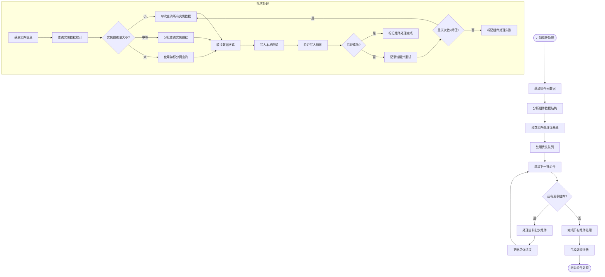

```mermaid
flowchart TD
    Start([开始组件处理]) --> FetchMetadata[获取组件元数据]
    FetchMetadata --> AnalyzeStructure[分析组件数据结构]
    AnalyzeStructure --> ClassifyComponents[分类组件处理优先级]
    
    ClassifyComponents --> ProcessPriorityQueue[处理优先队列]
    
    ProcessPriorityQueue --> GetNextBatch[获取下一批组件]
    GetNextBatch --> HasMore{还有更多组件?}
    
    HasMore -->|是| ProcessBatch[处理当前批次组件]
    HasMore -->|否| Complete[完成所有组件处理]
    
    subgraph BatchProcessing [批次处理]
        PB1[获取组件信息] --> PB2[查询实例数据统计]
        PB2 --> PB3{实例数据量大小?}
        
        PB3 -->|小| PB4[单次查询所有实例数据]
        PB3 -->|中等| PB5[分批查询实例数据]
        PB3 -->|大| PB6[使用游标分页查询]
        
        PB4 --> PB7[转换数据格式]
        PB5 --> PB7
        PB6 --> PB7
        
        PB7 --> PB8[写入本地存储]
        PB8 --> PB9[验证写入结果]
        PB9 --> PB10{验证成功?}
        
        PB10 -->|是| PB11[标记组件处理完成]
        PB10 -->|否| PB12[记录错误并重试]
        
        PB12 --> PB13{重试次数<阈值?}
        PB13 -->|是| PB4
        PB13 -->|否| PB14[标记组件处理失败]
    end
    
    ProcessBatch --> UpdateProgress[更新总体进度]
    UpdateProgress --> GetNextBatch
    
    Complete --> GenerateReport[生成处理报告]
    GenerateReport --> End([结束组件处理])
```