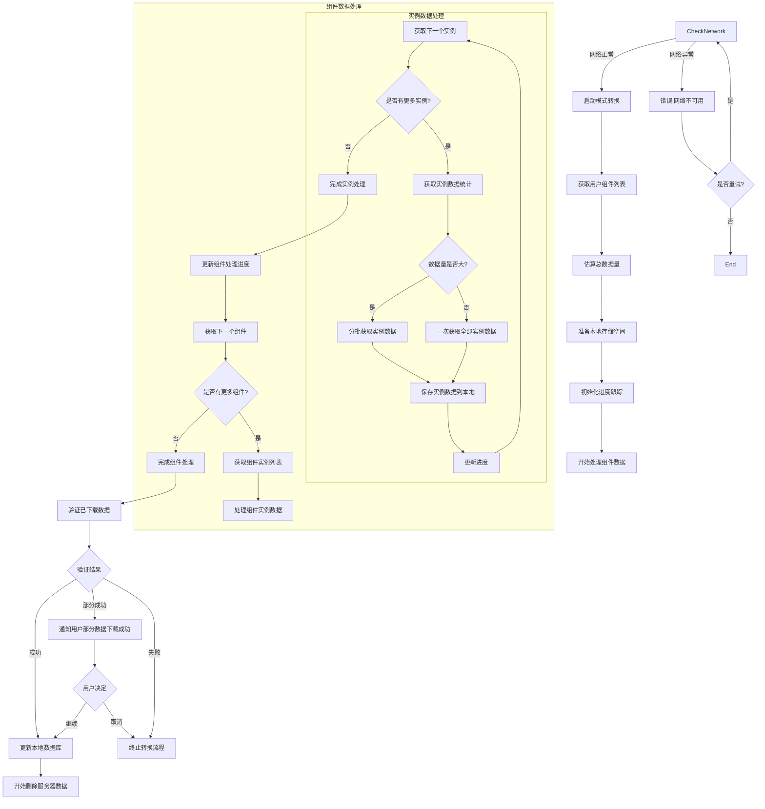

```mermaid
flowchart TD

    
    CheckNetwork -->|网络正常| StartTransition[启动模式转换]
    CheckNetwork -->|网络异常| Error2[错误:网络不可用]
    Error2 --> RetryCheck{是否重试?}
    RetryCheck -->|是| CheckNetwork
    RetryCheck -->|否| End
    
    StartTransition --> GetComponentList[获取用户组件列表]
    GetComponentList --> EstimateDataSize[估算总数据量]
    EstimateDataSize --> PrepareLocalStorage[准备本地存储空间]
    PrepareLocalStorage --> InitializeProgress[初始化进度跟踪]
    
    InitializeProgress --> ProcessComponents[开始处理组件数据]
    
    subgraph ComponentProcessing [组件数据处理]
        A[获取下一个组件] --> B{是否有更多组件?}
        B -->|否| ExitComponentLoop[完成组件处理]
        B -->|是| C[获取组件实例列表]
        C --> D[处理组件实例数据]
        
        subgraph InstanceProcessing [实例数据处理]
            D1[获取下一个实例] --> D2{是否有更多实例?}
            D2 -->|否| D8[完成实例处理]
            D2 -->|是| D3[获取实例数据统计]
            D3 --> D4{数据量是否大?}
            D4 -->|是| D5[分批获取实例数据]
            D4 -->|否| D6[一次获取全部实例数据]
            D5 --> D7[保存实例数据到本地]
            D6 --> D7
            D7 --> D9[更新进度]
            D9 --> D1
        end
        
        D8 --> E[更新组件处理进度]
        E --> A
    end
    
    ExitComponentLoop --> ValidateDownloadedData[验证已下载数据]
    ValidateDownloadedData --> ValidationResult{验证结果}
    ValidationResult -->|成功| UpdateLocalDatabase[更新本地数据库]
    ValidationResult -->|部分成功| NotifyPartial[通知用户部分数据下载成功]
    ValidationResult -->|失败| AbortProcess[终止转换流程]
    
    NotifyPartial --> UserDecision{用户决定}
    UserDecision -->|继续| UpdateLocalDatabase
    UserDecision -->|取消| AbortProcess
    
    UpdateLocalDatabase --> StartDeletingServerData[开始删除服务器数据]
```