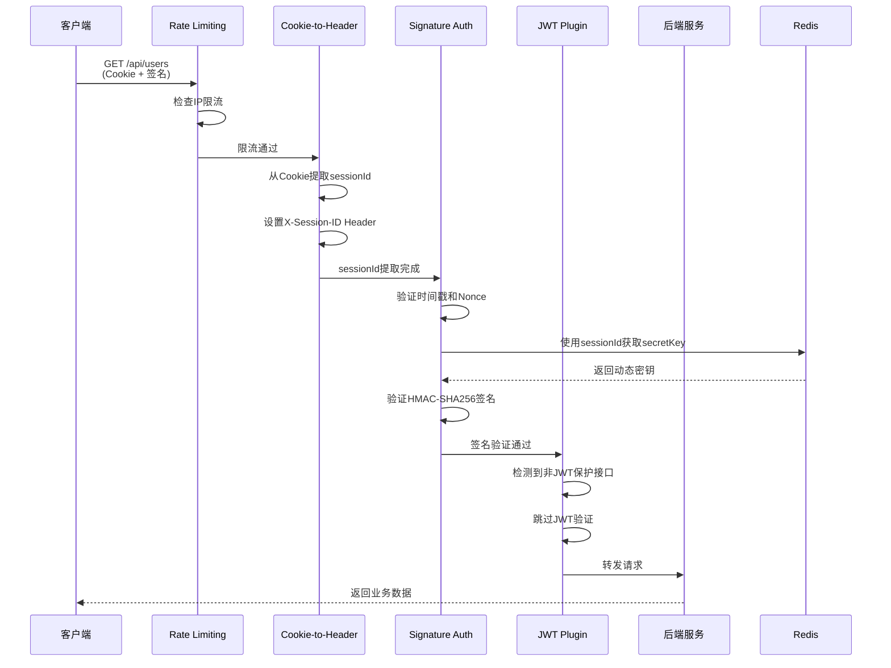

```mermaid
sequenceDiagram
    participant Client as 客户端
    participant RL as Rate Limiting
    participant CTH as Cookie-to-Header
    participant SA as Signature Auth  
    participant JWT as JWT Plugin
    participant Backend as 后端服务
    participant Redis as Redis

    Client->>RL: GET /api/users<br/>(Cookie + 签名)
    RL->>RL: 检查IP限流
    RL->>CTH: 限流通过
    
    CTH->>CTH: 从Cookie提取sessionId
    CTH->>CTH: 设置X-Session-ID Header  
    CTH->>SA: sessionId提取完成
    
    SA->>SA: 验证时间戳和Nonce
    SA->>Redis: 使用sessionId获取secretKey
    Redis-->>SA: 返回动态密钥
    SA->>SA: 验证HMAC-SHA256签名
    SA->>JWT: 签名验证通过
    
    JWT->>JWT: 检测到非JWT保护接口
    JWT->>JWT: 跳过JWT验证
    JWT->>Backend: 转发请求
    
    Backend-->>Client: 返回业务数据
```