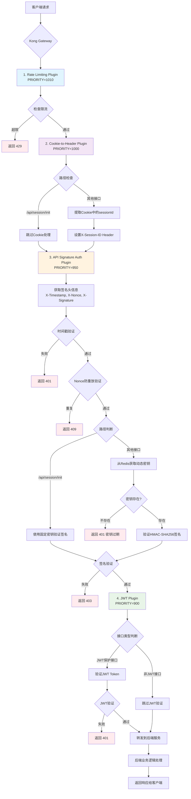

```mermaid
graph TB
    A[客户端请求] --> B{Kong Gateway}
    
    B --> C[1. Rate Limiting Plugin<br/>PRIORITY=1010]
    C --> C1{检查限流}
    C1 -->|超限| C2[返回 429]
    C1 -->|通过| D[2. Cookie-to-Header Plugin<br/>PRIORITY=1000]
    
    D --> D1{路径检查}
    D1 -->|/api/session/init| D2[跳过Cookie处理]
    D1 -->|其他接口| D3[提取Cookie中的sessionId]
    D3 --> D4[设置X-Session-ID Header]
    D2 --> E[3. API Signature Auth Plugin<br/>PRIORITY=950]
    D4 --> E
    
    E --> E1[获取签名头信息<br/>X-Timestamp, X-Nonce, X-Signature]
    E1 --> E2{时间戳验证}
    E2 -->|失败| E3[返回 401]
    E2 -->|通过| E4{Nonce防重放验证}
    E4 -->|重复| E5[返回 409]
    E4 -->|通过| E6{路径判断}
    
    E6 -->|/api/session/init| E7[使用固定密钥验证签名]
    E6 -->|其他接口| E8[从Redis获取动态密钥]
    E8 --> E9{密钥存在?}
    E9 -->|不存在| E10[返回 401 密钥过期]
    E9 -->|存在| E11[验证HMAC-SHA256签名]
    E7 --> E12{签名验证}
    E11 --> E12
    E12 -->|失败| E13[返回 403]
    E12 -->|通过| F[4. JWT Plugin<br/>PRIORITY=900]
    
    F --> F1{接口类型判断}
    F1 -->|JWT保护接口| F2[验证JWT Token]
    F1 -->|非JWT接口| F3[跳过JWT验证]
    F2 --> F4{JWT验证}
    F4 -->|失败| F5[返回 401]
    F4 -->|通过| G[转发到后端服务]
    F3 --> G
    
    G --> H[后端业务逻辑处理]
    H --> I[返回响应给客户端]
    
    style C fill:#e1f5fe
    style D fill:#f3e5f5  
    style E fill:#fff3e0
    style F fill:#e8f5e8
    style C2 fill:#ffebee
    style E3 fill:#ffebee
    style E5 fill:#ffebee
    style E10 fill:#ffebee
    style E13 fill:#ffebee
    style F5 fill:#ffebee
```