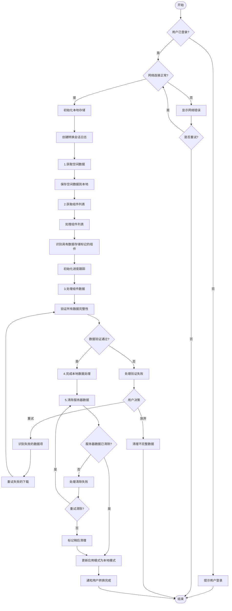

```mermaid
flowchart TD
    Start([开始]) --> CheckLogin{用户已登录?}
    CheckLogin -->|否| LoginPrompt[提示用户登录]
    LoginPrompt --> End([结束])
    CheckLogin -->|是| CheckNetwork{网络连接正常?}
    
    CheckNetwork -->|否| NetworkError[显示网络错误]
    NetworkError --> RetryOption{是否重试?}
    RetryOption -->|是| CheckNetwork
    RetryOption -->|否| End
    
    CheckNetwork -->|是| InitLocalStorage[初始化本地存储]
    InitLocalStorage --> CreateSessionLog[创建转换会话日志]
    CreateSessionLog --> FetchWorkspaceData[1.获取空间数据]
    
    FetchWorkspaceData --> StoreWorkspaceData[保存空间数据到本地]
    StoreWorkspaceData --> FetchComponentList[2.获取组件列表]
    
    FetchComponentList --> ProcessComponentList[处理组件列表]
    ProcessComponentList --> IdentifyDataComponents[识别具有数据存储标记的组件]
    
    IdentifyDataComponents --> InitProgressTracking[初始化进度跟踪]
    InitProgressTracking --> ProcessComponents[3.处理组件数据]
    
    ProcessComponents --> VerifyAllData[验证所有数据完整性]
    VerifyAllData --> DataVerified{数据验证通过?}
    
    DataVerified -->|否| HandleVerificationFailure[处理验证失败]
    HandleVerificationFailure --> UserDecision{用户决策}
    UserDecision -->|重试| IdentifyFailedData[识别失败的数据项]
    IdentifyFailedData --> RetryFailedDownloads[重试失败的下载]
    RetryFailedDownloads --> VerifyAllData
    UserDecision -->|放弃| CleanupIncomplete[清理不完整数据]
    CleanupIncomplete --> End
    
    DataVerified -->|是| FinalizeLocalData[4.完成本地数据处理]
    FinalizeLocalData --> ClearServerData[5.清除服务器数据]
    
    ClearServerData --> ServerCleared{服务器数据已清除?}
    ServerCleared -->|否| HandleClearFailure[处理清除失败]
    HandleClearFailure --> RetryServerClear{重试清除?}
    RetryServerClear -->|是| ClearServerData
    RetryServerClear -->|否| MarkForLaterCleanup[标记稍后清理]
    
    ServerCleared -->|是| UpdateAppMode[更新应用模式为本地模式]
    
    MarkForLaterCleanup --> UpdateAppMode
    UpdateAppMode --> NotifyComplete[通知用户转换完成]
    NotifyComplete --> End
```